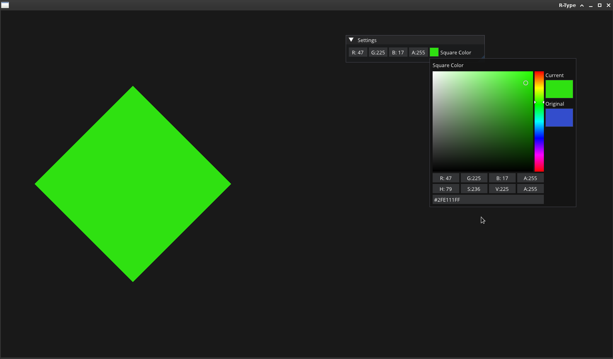

# Application example with Exodia Game Engine

## Description

This example shows a simple application using Exodia, a C++ game engine.
The application creates a rendering window and uses a layer (DefaultLayer) to manage game logic and basic graphics rendering.

## File contents

- DefaultLayer.hpp: Contains the definition of the DefaultLayer class, the engine's base layer.
- DefaultLayer.cpp: Implementation of DefaultLayer class methods for game logic and rendering.
- ApplicationExample.hpp: An application example class using DefaultLayer and initializing the application with the Exodia engine.
- Exodia/EntryPoint.hpp : Application entry point that creates and launches the Exodia application.

## Main features
    
    DefaultLayer: A layer managing updates, graphics rendering (using Renderer2D), and camera handling.
    ApplicationExample: Main example class initializing the application and using DefaultLayer.

## Code details

Sample Code - DefaultLayer.hpp

```cpp
namespace Exodia {

    class DefaultLayer : public Layer {
        public:
    
            // Constructor & Destructor
            DefaultLayer();
            ~DefaultLayer() = default;
    
        public:
            // Method
            void OnUpdate(Timestep ts) override;
            void OnImGUIRender() override;
            void OnEvent(Event &event) override;
        
        private:
            // Attributs
            Exodia::OrthographicCameraController _CameraController;
            glm::vec4 _SquareColor;
    };
};
```

This DefaultLayer class inherits from Exodia's Layer class and manages game logic and rendering. It includes methods such as OnUpdate, OnImGUIRender and OnEvent for managing updates, ImGui rendering and events.

Sample Code - DefaultLayer.cpp

```cpp
void DefaultLayer::OnUpdate(Exodia::Timestep ts) {
    // Game and rendering update logic
    // ...
}

void DefaultLayer::OnImGUIRender() {
    // Display an ImGui window to change the color of the square
    ImGui::Begin("Settings");
    ImGui::ColorEdit4("Square Color", glm::value_ptr(_SquareColor));
    ImGui::End();
}

void DefaultLayer::OnEvent(Exodia::Event &event) {
    // Event management (e.g. camera manipulation)
    _CameraController.OnEvent(event);
}
```

In DefaultLayer.cpp, the OnUpdate, OnImGUIRender and OnEvent methods are implemented to handle updates, ImGui rendering and events respectively. These methods are called during the game cycle in the application.

# Running the example

To run the example, you can use the following commands:

```bash
./bin_examples/application
```

# Screenshots


