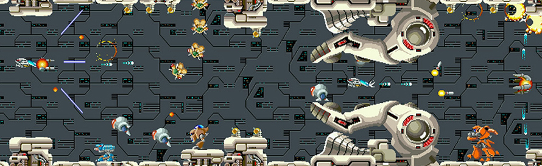
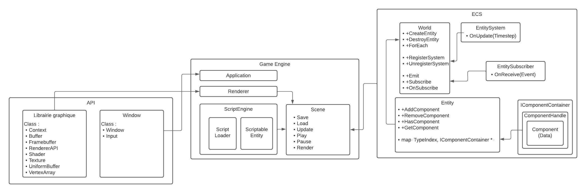

# EPITECH Project - R-Type

<a href="https://img.shields.io/badge/MADE%20WITH-C%2B%2B-015482" alt="C++">
    
</a>
<a href="https://img.shields.io/badge/MADE%20WITH-OpenGL-63809f" alt="OpenGL">
    
</a>
<a href="https://img.shields.io/badge/MADE%20WITH-VCPKG-f9c438" alt="Vcpkg">
    
</a>
<a href="https://img.shields.io/badge/MADE%20WITH-CMAKE-CB2030" alt="Cmake">
    
</a>



> This project of the Advanced C++ knowledge unit will introduce you to networked video game development, and will give you the opportunity to explore advanced development techniques as well as to learn good software engineering practices.
The goal is to implement a multithreaded server and a graphical client for a well-known legacy video game called 'R-Type', using a game engine of your own design.

## Installation

**VCPKG :**
```bash
git clone git@github.com:microsoft/vcpkg.git
```

**Linux :**
```bash
./vcpkg/bootstrap-vcpkg.sh
export VCPKG_ROOT=/path/vcpkg
source ~./bashrc
```
```bash
mkdir build
cd build
```

If you have ninja:
```
cmake .. -G Ninja
ninja
```
else:
```bash
cmake ..
cmake --build .
```

**Windows :**
```bash
./vcpkg/bootstrap-vcpkg.bat
```
- In advanced parameters system, add the environnement variable : `VCPKG_ROOT`, that contain the `/path/vcpkg`.
- When it's done, restart your computer.

```bash
cmake ..
cmake --build .
```

## Usage & Examples

**Products to be delivered**
`r-type_server` `r-type_client`

**In Terminal**
```bash
./r-type_server
```

**In another terminal**
```bash
./r-type_client [PORT]
```

## UML


## Authors

* **Ethan Hernou** _alias_ [@Phara](https://github.com/PharaEthan)
* **Axel Rohee** _alias_ [@RoheeAxel](https://github.com/RoheeAxel)
* **Enzo Garnier** _alias_ [@EnzoGrn](https://github.com/EnzoGrn)
* **Thomas Juin** _alias_ [@Chocofraise](https://github.com/thomasjuin1)
* **Maël Becel** _alias_ [@Medhi](https://github.com/maelbecel)
