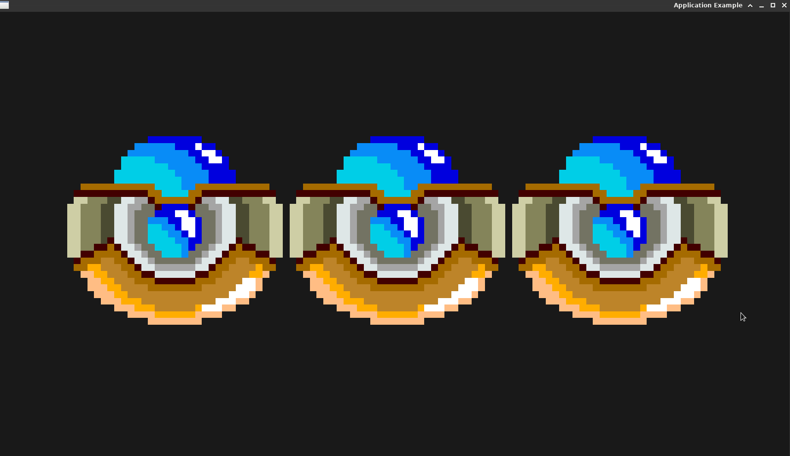

# Application Manipulating Textures with Exodia Game Engine Description

## Description

This example demonstrates an application utilizing textures within Exodia, a C++ game engine.
The application creates a rendering window and manages the display of multiple textured entities within the scene.

## File contents

- ApplicationExample.cpp: Entry point of the application defining the main application class.
- DefaultLayer.hpp: Contains the definition of the DefaultLayer class, responsible for managing the scene and rendering textured entities.
- DefaultLayer.cpp: Implementation of methods in the DefaultLayer class, including entity creation and rendering logic.
- Exodia/EntryPoint.hpp : Application entry point that creates and launches the Exodia application.

## Key Components

### ApplicationExample

The main application class initializing the engine and setting up the DefaultLayer.

### DefaultLayer
Methods

- `OnAttach()`: Initializes the scene and creates entities with textured sprites.
- `OnDetach()`: Destroys the world upon detachment.
- `OnUpdate()`: Handles the rendering of entities and updates the scene.
- `OnEvent()` : Manages events in the scene (e.g., camera events).

Attributes

    OrthographicCameraController: Manages the camera within the scene.
    World                       : Holds the entities and manages the scene.

### Scene Initialization

The `OnAttach()` method sets up the scene by creating space ships and initializing their textured sprites.
It creates entities, adds necessary components (such as IDComponent, TransformComponent, SpriteRendererComponent), and assigns textures to the sprites.


### Scene Rendering

The `OnUpdate()` method updates the scene during each frame.
It updates the camera, clears the render, updates the world, and renders entities with their textures using Renderer2D.

### Working with Textures

The application utilizes textured sprites within the scene by loading textures and assigning them to entities as subtextures.
It draws these subtextures using Renderer2D's `DrawSprite()` method.

## Running the example

To run the example, use the following commands:

```bash
./bin_examples/application
```

# Screenshots


