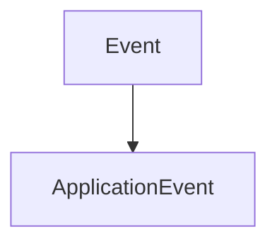

# ApplicationEvent

The ApplicationEvent part of the Events. It contains the classes that will be used to manage application events.

It herites from the Event class.



It contains the following classes with their own methods:

## WindowResizeEvent

The WindowResizeEvent struct of the Events. It contains the classes that will be used to manage the window resize event.

It contains the following methods:

### GetWidth

```c++
unsigned int GetWidth() const;
```

It returns the width of the window.

### GetHeight

```c++
unsigned int GetHeight() const;
```

It returns the height of the window.

### ToString

```c++
std::string ToString() const override;
```

It converts the event to a string.


## WindowCloseEvent

The WindowCloseEvent struct of the Events. It contains the classes that will be used to manage the window close event.

It doesn't contain any specific method.

## AppTickEvent

The AppTickEvent struct of the Events. It contains the classes that will be used to manage the app tick event.

It doesn't contain any specific method.

## AppUpdateEvent

The AppUpdateEvent struct of the Events. It contains the classes that will be used to manage the app update event.

It doesn't contain any specific method.

## AppRenderEvent

The AppRenderEvent struct of the Events. It contains the classes that will be used to manage the app render event.

It doesn't contain any specific method.

## WindowDropEvent

The WindowDropEvent struct of the Events. It contains the classes that will be used to manage the window drop event.

It contains the following method:

### GetPaths

```c++
const std::vector<std::filesystem::path> &GetPaths() const
```

It returns the paths of the files dropped.


