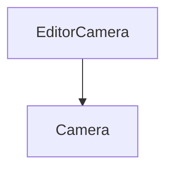

# EditorCamera

The EditorCamera class of the Camera. It contains the classes that will be used to create editor cameras.

It herits from the Camera class.



It defines the following methods:

## Constructor

```c++
EditorCamera(float fov, float aspectRatio, float nearClip, float farClip);
```

It initializes the EditorCamera.

It takes the following parameters:

| Name      | Type   | Description |
|-----------|--------|-------------|
| fov       | float  | The fov |
| aspectRatio | float  | The aspect ratio |
| nearClip  | float  | The near clip |
| farClip   | float  | The far clip |

It can be used like this:

```c++
EditorCamera* editorCamera = new EditorCamera(fov, aspectRatio, nearClip, farClip);
```

## OnUpdate

```c++
void OnUpdate(Timestep ts);
```

This function updates the EditorCamera.

It takes the following parameters:

| Name | Type | Description |
|------|------|-------------|
| ts | Timestep | The timestep |

It can be used like this:

```c++
editorCamera->OnUpdate(ts);
```

## OnEvent

```c++
void OnEvent(Event &e);
```

This function is call when an event is triggered.

It takes the following parameters:

| Name | Type | Description |
|------|------|-------------|
| e | Event& | The event |

It can be used like this:

```c++
editorCamera->OnEvent(e);
```

## UpdateProjection

```c++
void UpdateProjection();
```

This function updates the projection.

It can be used like this:

```c++
editorCamera->UpdateProjection();
```

## UpdateView

```c++
void UpdateView();
```

This function updates the view.

It can be used like this:

```c++
editorCamera->UpdateView();
```

## CalculatePosition

```c++
glm::vec3 CalculatePosition() const;
```

This function calculates the position.
    
It returns a glm::vec3.

It can be used like this:

```c++
glm::vec3 position = editorCamera->CalculatePosition();
```

## GetDistance

```c++
float GetDistance() const;
```

This function returns the distance.

It returns a float.

It can be used like this:

```c++
float distance = editorCamera->GetDistance();
```

## SetDistance

```c++
void SetDistance(float distance);
```

This function sets the distance.

It takes the following parameters:

| Name | Type | Description |
|------|------|-------------|
| distance | float | The distance |

It can be used like this:

```c++
editorCamera->SetDistance(distance);
```

## SetViewportSize

```c++
void SetViewportSize(float width, float height);
```

This function sets the viewport size.

It takes the following parameters:

| Name | Type | Description |
|------|------|-------------|
| width | float | The width |
| height | float | The height |

It can be used like this:

```c++
editorCamera->SetViewportSize(width, height);
```

## GetViewMatrix

```c++
const glm::mat4 &GetViewMatrix() const;
```

This function returns the view matrix.

It returns a const glm::mat4&.

It can be used like this:

```c++
const glm::mat4& viewMatrix = editorCamera->GetViewMatrix();
```

## GetViewProjection

```c++
glm::mat4 &GetViewProjection() const;
```

This function returns the view projection.

It returns a glm::mat4&.

It can be used like this:

```c++
glm::mat4& viewProjection = editorCamera->GetViewProjection();
```

## GetPosition

```c++
const glm::vec3 &GetPosition() const;
```

This function returns the position.

It returns a const glm::vec3&.

It can be used like this:

```c++
const glm::vec3& position = editorCamera->GetPosition();
```

## GetPitch

```c++
float GetPitch() const;
```

This function returns the pitch.

It returns a float.

It can be used like this:

```c++
float pitch = editorCamera->GetPitch();
```

## GetYaw

```c++
float GetYaw() const;
```

This function returns the yaw.

It returns a float.

It can be used like this:

```c++
float yaw = editorCamera->GetYaw();
```

## GetUpDirection

```c++
glm::vec3 GetUpDirection() const;
```

This function returns the up direction.

It returns a glm::vec3.

It can be used like this:

```c++
glm::vec3 upDirection = editorCamera->GetUpDirection();
```

## GetRightDirection

```c++
glm::vec3 GetRightDirection() const;
```

This function returns the right direction.
    
It returns a glm::vec3.

It can be used like this:

```c++
glm::vec3 rightDirection = editorCamera->GetRightDirection();
```

## GetForwardDirection

```c++
glm::vec3 GetForwardDirection() const;
```

This function returns the forward direction.

It returns a glm::vec3.

It can be used like this:

```c++
glm::vec3 forwardDirection = editorCamera->GetForwardDirection();
```

## GetOrientation

```c++
const glm::quat &GetOrientation() const;
```

This function returns the orientation.

It returns a const glm::quat&.

It can be used like this:

```c++
const glm::quat& orientation = editorCamera->GetOrientation();
```
