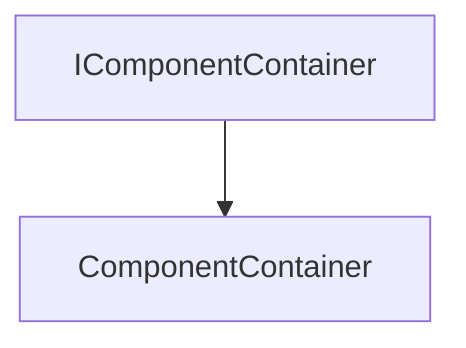

# Component

The Component part of the ECS, contain all the [Default Components](Components.md).

It defines two classes:
- [**ComponentContainer**](#componentcontainer)
- [**ComponentHandle**](#componenthandle)


## ComponentContainer

The `ComponentContainer` class is used to manage the components.

It uses the following template :
```c++
template<typename Component>
```

And it herites from the `IComponentContainer` class.



### Constructor

```c++
ComponentContainer();
ComponentContainer(const Component &data);
ComponentContainer(const Buffer &data);
```

It creates a component container.

Here is an example of how to use it:

```c++
ComponentContainer componentContainer;
ComponentContainer componentContainer(data);
ComponentContainer componentContainer(buffer);
```

### GetTypeIndexOfComponent

```c++
TypeIndex GetTypeIndexOfComponent()
```

It returns the type index of the component.

Here is an example of how to use it:

```c++
TypeIndex typeIndex = componentContainer.GetTypeIndexOfComponent();
```

### Destroy

```c++
void Destroy(World *world)
```

It destroys the component container.

The method takes the following parameters:

| Name  | Type  | Description |
|-------|-------|-------------|
| world | World * | The world   |

Here is an example of how to use it:

```c++
World *world;
componentContainer.Destroy(world);
```

### Removed

```c++
void Removed(Entity *entity)
```

It removes the component container.

The method takes the following parameters:

| Name   | Type    | Description |
|--------|---------|-------------|
| entity | Entity * | The entity  |

Here is an example of how to use it:

```c++
Entity *entity;
componentContainer.Removed(entity);
```

### Serialize

```c++
void Serialize(YAML::Emitter &out)
```

It serializes the component container.

The method takes the following parameters:

| Name | Type | Description |
|------|------|-------------|
| out  | YAML::Emitter & | The emitter |

Here is an example of how to use it:

```c++
YAML::Emitter out;
componentContainer.Serialize(out);
```

### Deserialize

```c++
void Deserialize(const YAML::Node &node)
```

It deserializes the component container.

The method takes the following parameters:

| Name | Type | Description |
|------|------|-------------|
| node | const YAML::Node & | The node |

Here is an example of how to use it:

```c++
YAML::Node node;
componentContainer.Deserialize(node);
```

### OnImGuiRender

```c++
void OnImGuiRender()
```

It renders the component container.

Here is an example of how to use it:

```c++
componentContainer.OnImGuiRender();
```

### SerializeData

```c++
Buffer SerializeData()
```

It serializes the data.

Here is an example of how to use it:

```c++
Buffer buffer = componentContainer.SerializeData();
```

## ComponentHandle

The `ComponentHandle` class is used to manage the component handles.

It uses the following template :
```c++
template<typename Component>
```


### Constructor {id=constructor1}

```c++
ComponentHandle(Component *component);
```

It creates a component handle.

The constructor takes the following parameters:

| Name      | Type       | Description |
|-----------|------------|-------------|
| component | Component * | The component |

Here is an example of how to use it:

```c++
Component *component;
ComponentHandle componentHandle(component);
```

### Get

```c++
Component &Get()
```

It gets the component.

Here is an example of how to use it:

```c++
Component &component = componentHandle.Get();
```

### IsValid

```c++
bool IsValid()
```

It checks if the component handle is valid.

Here is an example of how to use it:

```c++
bool isValid = componentHandle.IsValid();
```
