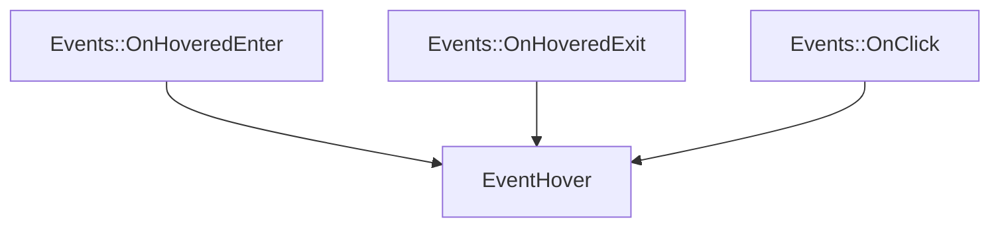

# EventSubscriber

The EventSubscriber part of the ECS. It contains the classes that will be used to manage event subscribers.

It defines the class `EventHover` that herites from `EventSubscriber<Events::OnHoveredEnter>`, `EventSubscriber<Events::OnHoveredExit>` and `EventSubscriber<Events::OnClick>`, and EventSubscriber<Events::OnHoveredExit>



It can be initialized like that :

```c++
EventHover eventHover;
```
