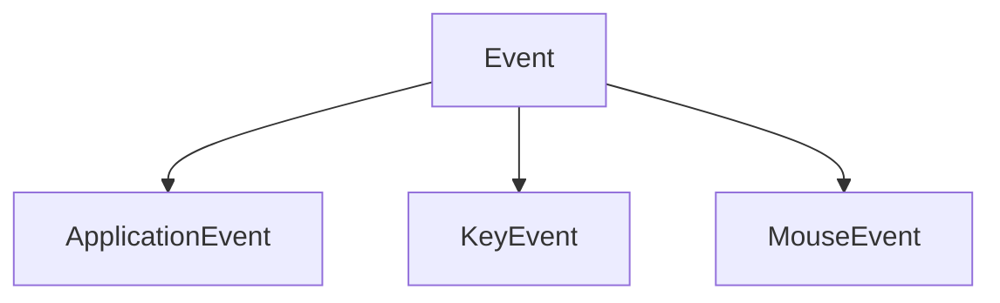

# Events

This is the Events part of Exodia. It contains the classes that will be used to manage events.

There are 3 events types:

- [**ApplicationEvent**](ApplicationEvent.md): The ApplicationEvent part of the Events. It contains the classes that will be used to manage application events.
- [**KeyEvent**](KeyEvent.md): The KeyEvent part of the Events. It contains the classes that will be used to manage key events.
- [**MouseEvent**](MouseEvent.md): The MouseEvent part of the Events. It contains the classes that will be used to manage mouse events.

All of them herites from **Event**, which is the base class of the Events.



The Event class of the Events. It contains the classes that will be used to manage events.

## EventType

The EventType enum of the Events. It contains the classes that will be used to manage event types.

It contains the following elements:
- **None**: The None element of the EventType enum.
- **WindowClose**: When the window is closed.
- **WindowResize**: When the window is resized.
- **WindowFocus**: When the window is focused.
- **WindowLostFocus**: When the window lost the focus.
- **WindowMoved**: When the window is moved.
- **WindowDrop**: When the window is dropped.
- **AppTick**: When the application is ticked.
- **AppUpdate**: When the application is updated.
- **AppRender**: When the application is rendered.
- **KeyPressed**: When a key is pressed.
- **KeyReleased**: When a key is released.
- **KeyTyped**: When a key is typed.
- **MouseButtonPressed**: When a mouse button is pressed.
- **MouseButtonReleased**: When a mouse button is released.
- **MouseMoved**: When the mouse is moved.
- **MouseScrolled**: When the mouse is scrolled.

## EventCategory

The EventCategory enum of the Events. It contains the classes that will be used to manage event categories.

It contains the following elements:
- **None** (0): The None element of the EventCategory enum.
- **EventCategoryApplication** (1 << 0): The Application element of the EventCategory enum.
- **EventCategoryInput** (1 << 1): The Input element of the EventCategory enum.
- **EventCategoryKeyboard** (1 << 2): The Keyboard element of the EventCategory enum.
- **EventCategoryMouse** (1 << 3): The Mouse element of the EventCategory enum.
- **EventCategoryMouseButton** (1 << 4): The MouseButton element of the EventCategory enum.

## ToString

```c++
virtual std::string ToString() const;
```

It converts the event to a string.

If not overriden, it returns the name of the event.


## GetEventType

```c++
virtual EventType GetEventType() const = 0;
```

It gets the event type.

If not overriden, it returns nothing.

## GetName

```c++
virtual const char *GetName() const = 0;
```

It gets the name of the event.

If not overriden, it returns nothing.

## GetCategoryFlags

```c++
virtual int GetCategoryFlags() const = 0;
```

It gets the category flags of the event.

If not overriden, it returns nothing.

## IsInCategory

```c++
bool IsInCategory(EventCategory category) const;
```

It checks if the event is in a category.

The method takes the following parameters:

| Name | Type | Description |
|------|------|-------------|
| category | EventCategory | The category |


## EventDispatcher

The EventDispatcher class of the Events. It contains the classes that will be used to manage event dispatchers.

You can create a dispatcher with the following code:

```c++
EventDispatcher dispatcher(event);
```

And to Dispatch an event, you can use the following function:

```c++
template<typename T, typename F>
bool Dispatch(const F &func)
```

Like this :

```c++
EventDispatcher dispatcher(event);

dispatcher.Dispatch<EventType>([](EventType &event) {
    // Do something with the event
});
```


