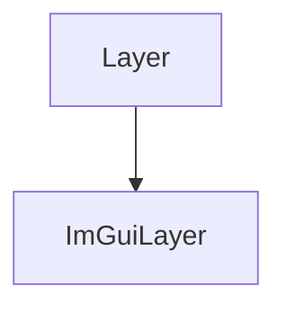

# ImGuiLayer

The ImGuiLayer class of the ImGUI part of the Game Engine. It contains the classes that will be used to create and use the ImGuiLayer.

It herites from the Layer class.



It contains the following methods:

## Constructor

```c++
ImGuiLayer();
```

It creates the ImGuiLayer.

It can be used like this:

```c++
ImGuiLayer* imGuiLayer = new ImGuiLayer();
```

## OnAttach

```c++
void OnAttach() override;
```

It attaches the ImGuiLayer.

It can be used like this:

```c++
ImGuiLayer* imGuiLayer = new ImGuiLayer();
imGuiLayer->OnAttach();
```

## OnDetach

```c++
void OnDetach() override;
```

It detaches the ImGuiLayer.

It can be used like this:

```c++
ImGuiLayer* imGuiLayer = new ImGuiLayer();
imGuiLayer->OnDetach();
```

## OnEvent

```c++
void OnEvent(Event& event) override;
```

It handles the events of the ImGuiLayer.

It takes the following parameters:

| Name  | Type             | Description  |
|-------|------------------|--------------|
| event | Event&           | The event    |

It can be used like this:

```c++
ImGuiLayer* imGuiLayer = new ImGuiLayer();
Event event;
imGuiLayer->OnEvent(event);
```

## Begin

```c++
void Begin();
```

It begins the ImGuiLayer.

It can be used like this:

```c++
ImGuiLayer* imGuiLayer = new ImGuiLayer();
imGuiLayer->Begin();
```

## End

```c++
void End();
```

It ends the ImGuiLayer.

It can be used like this:

```c++
ImGuiLayer* imGuiLayer = new ImGuiLayer();
imGuiLayer->End();
```

## SetBlockEvents

```c++
void SetBlockEvents(bool block);
```

It sets if the events are blocked.

It takes the following parameters:

| Name  | Type             | Description  |
|-------|------------------|--------------|
| block | bool             | The block    |

It can be used like this:

```c++
ImGuiLayer* imGuiLayer = new ImGuiLayer();
bool block;
imGuiLayer->SetBlockEvents(block);
```

## SetDarkThemeColors

```c++
void SetDarkThemeColors();
```

It sets the dark theme colors.

It can be used like this:

```c++
ImGuiLayer* imGuiLayer = new ImGuiLayer();
imGuiLayer->SetDarkThemeColors();
```

## GetActiveWidgetID

```c++
uint32_t GetActiveWidgetID();
```

It gets the active widget ID.

It can be used like this:

```c++
ImGuiLayer* imGuiLayer = new ImGuiLayer();
uint32_t activeWidgetID = imGuiLayer->GetActiveWidgetID();
```

