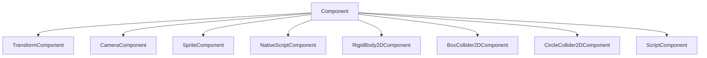
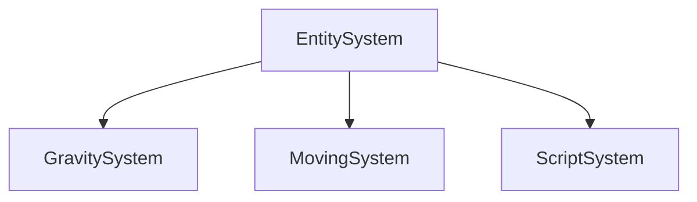
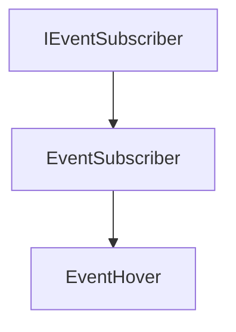

# Interface

The Interface part of the ECS. It contains the all the interfaces.

It contains the following elements:

- [**Component**](#component) : The Component interface of the ECS. It contains the classes that will be used to manage components.
- [**EntitySystem**](#entitysystem) : The EntitySystem interface of the ECS. It contains the classes that will be used to manage entity systems.
- [**EventSubscriber**](#eventsubscriber) : The EventSubscriber interface of the ECS. It contains the classes that will be used to manage event subscribers.
- [**IComponentContainer**](#icomponentcontainer) : The IComponentContainer interface of the ECS. It contains the classes that will be used to manage component containers.

## Component

The Component interface of the ECS. It contains the classes that will be used to manage components.

All the Components must herit from this class :



It contains the following methods:

### DeserializeData

```c++
virtual void DeserializeData(Buffer data);
```

It deserializes the data.

The method takes the following parameters:

| Name | Type | Description |
|------|------|-------------|
| data | Buffer | The data |

If it is not overriden, it does this :

```c++
Memcopy(&data, this, sizeof(*this));
```

### SerializeData

```c++
virtual Buffer SerializeData();
```

It serializes the data.

If it is not overriden, it does this :

```c++
return Buffer(this, sizeof(*this));
```

### Serialize

```c++
virtual void Serialize(UNUSED(YAML::Emitter &out))
```

It serializes the component.

The method takes the following parameters:

| Name  | Type             | Description  |
|-------|------------------|--------------|
| out   | YAML::Emitter &  | The emitter  |

If it is not overriden, it does nothing.

### Deserialize

```c++
virtual void Deserialize(UNUSED(YAML::Node &in))
```

It deserializes the component.

The method takes the following parameters:

| Name  | Type             | Description  |
|-------|------------------|--------------|
| in    | YAML::Node &     | The node     |

If it is not overriden, it does nothing.


### DrawComponent

```c++
virtual void DrawComponent()
```

It draws the component.

If it is not overriden, it does nothing.ImGuizmo.h

## EntitySystem

The EntitySystem interface of the ECS. It contains the classes that will be used to manage entity systems.

All the EntitySystems must herit from this class :



It contains the following methods:

### Configure

```c++
virtual void Configure(UNUSED(World *world))
```

It configures the entity system.

The method takes the following parameters:

| Name  | Type             | Description  |
|-------|------------------|--------------|
| world | World *          | The world    |

If it is not overriden, it does nothing.

### Unconfigure

```c++
virtual void Unconfigure(UNUSED(World *world))
```

It unconfigures the entity system.

The method takes the following parameters:

| Name  | Type             | Description  |
|-------|------------------|--------------|
| world | World *          | The world    |

If it is not overriden, it does nothing.

### Update

```c++
virtual void Update(UNUSED(World *world), UNUSED(Timestep ts))
```

It updates the entity system.

The method takes the following parameters:

| Name  | Type             | Description  |
|-------|------------------|--------------|
| world | World *          | The world    |
| ts    | Timestep         | The timestep |

If it is not overriden, it does nothing.

## EventSubscriber

The EventSubscriber interface of the ECS. It contains the classes that will be used to manage event subscribers.

It herit of `IEventSubscriber` and all the EventSubscribers must herit from this class :



It contains the following methods:

### Receive

```c++
virtual void Receive(UNUSED(World *world), UNUSED(const Events &event))
```

It receives an event.

The method takes the following parameters:

| Name  | Type       | Description  |
|-------|------------|--------------|
| world | World *    | The world    |
| event | Events     | The event    |

If it is not overriden, it does nothing.


## IComponentContainer

The IComponentContainer interface of the ECS. It contains the classes that will be used to manage component containers.

It contains the following methods:

### GetTypeIndexOfComponent

```c++
virtual TypeIndex GetTypeIndexOfComponent() = 0;
```

It gets the type index of the component.

If it is not overriden, it does nothing.

### Serialize {id="serialize1"}

```c++
virtual void Serialize(UNUSED(YAML::Emitter &out)) = 0;
```

It serializes the component container.

The method takes the following parameters:

| Name  | Type             | Description  |
|-------|------------------|--------------|
| out   | YAML::Emitter &  | The emitter  |

If it is not overriden, it does nothing.

### Deserialize {id="deserialize1"}

```c++
virtual void Deserialize(UNUSED(YAML::Node &in)) = 0;
```

It deserializes the component container.

The method takes the following parameters:

| Name  | Type             | Description  |
|-------|------------------|--------------|
| in    | YAML::Node &     | The node     |

If it is not overriden, it does nothing.

### Destroy

```c++
virtual void Destroy(World *world) = 0;
```

It destroys the component container.

The method takes the following parameters:

| Name  | Type             | Description  |
|-------|------------------|--------------|
| world | World *          | The world    |

If it is not overriden, it does nothing.

### Removed

```c++
virtual void Removed(Entity *entity) = 0;
```

It removes the component container.

The method takes the following parameters:

| Name   | Type             | Description  |
|--------|------------------|--------------|
| entity | Entity *         | The entity   |

If it is not overriden, it does nothing.

### OnImGuiRender

```c++
virtual void OnImGuiRender() = 0;
```

It renders the component container.

If it is not overriden, it does nothing.

### SerializeData {id="serialize2"}

```c++
virtual Buffer SerializeData() = 0;
```

It serializes the data.

If it is not overriden, it does nothing.


