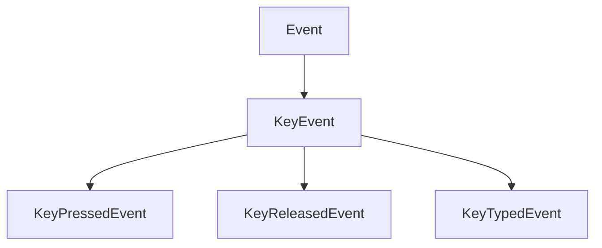
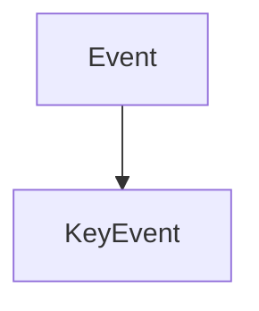
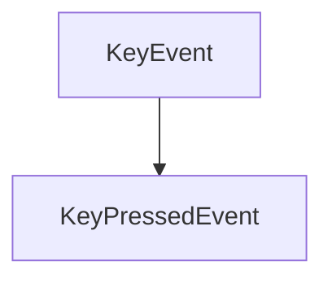
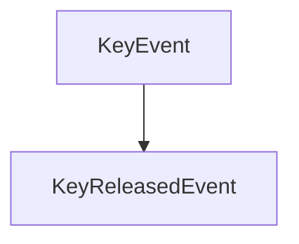
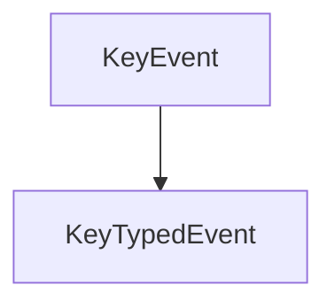

# KeyEvent

The KeyEvent class of the Events. It contains the classes that will be used to manage key events.

It herites from the Event class.



It contains the following classes with their own methods:

## KeyEvent

The KeyEvent class of the Events. It contains the classes that will be used to manage key events.

It herites from the Event class.



It contains the following method:

### GetKeyCode

```c++
int GetKeyCode() const;
```

It returns the key code.

## KeyPressedEvent

The KeyPressedEvent class of the Events. It contains the classes that will be used to manage the key pressed event.

It herites from the KeyEvent class.



It contains the following methods:

### IsRepeat

```c++
bool IsRepeat() const;
```

It returns if the key is repeated.

## KeyReleasedEvent

The KeyReleasedEvent class of the Events. It contains the classes that will be used to manage the key released event.

It herites from the KeyEvent class.



It doesn't contain any specific method.

## KeyTypedEvent

The KeyTypedEvent class of the Events. It contains the classes that will be used to manage the key typed event.

It herites from the KeyEvent class.



It doesn't contain any specific method.


