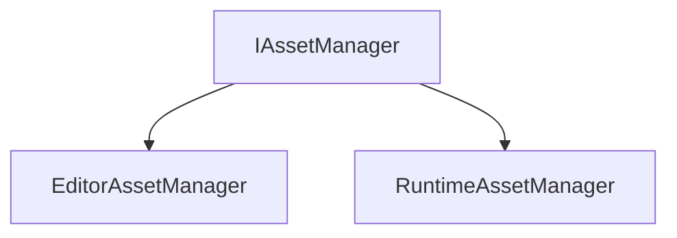

# Manager

The Manager part of the Asset is used to manage the assets.

The Manager is divided by 2 parts : 

- [**AssetManager**](#assetmanager) : The Asset part of the Manager. It contains the classes that will be used to manage assets.
- [**IAssetManager**](#iassetmanager) : The IAsset part of the Manager. It contains the classes that will be used to manage IAssets.

## AssetManager

The AssetManager class is used to manage assets.

### GetAsset

```c++
template <typename T>
static Ref<T> GetAsset(AssetHandle handle);
```

It gets an asset.

The method takes the following parameters:

| Name   | Type         | Description      |
|--------|--------------|------------------|
| handle | AssetHandle  | The asset handle |

Here is an example of how to use it:

```c++
AssetHandle handle;
Ref<Asset> asset = AssetManager::GetAsset<Asset>(handle);
```

### IsAssetHandleValid

```c++
static bool IsAssetHandleValid(AssetHandle handle);
```

It checks if the asset handle is valid.

The method takes the following parameters:

| Name   | Type         | Description      |
|--------|--------------|------------------|
| handle | AssetHandle  | The asset handle |

Here is an example of how to use it:

```c++
AssetHandle handle;
bool isValid = AssetManager::IsAssetHandleValid(handle);
```

### IsAssetLoaded

```c++
static bool IsAssetLoaded(AssetHandle handle);
```

It checks if the asset is loaded.

The method takes the following parameters:

| Name   | Type         | Description      |
|--------|--------------|------------------|
| handle | AssetHandle  | The asset handle |

Here is an example of how to use it:

```c++
if (AssetManager::IsAssetLoaded(handle)) {
    std::cout << "Asset is loaded" << std::endl;
}
```

### GetAssetType

```c++
static AssetType GetAssetType(AssetHandle handle);
```

It gets the asset type.

The method takes the following parameters:

| Name   | Type         | Description      |
|--------|--------------|------------------|
| handle | AssetHandle  | The asset handle |

Here is an example of how to use it:

```c++
AssetHandle handle;
AssetType type = AssetManager::GetAssetType(handle);
```

## IAssetManager

The IAssetManager class is used to manage IAssets.



The two classes that inherit from IAssetManager are :

- **EditorAssetManager** : The Editor part of the IAssetManager. It contains the classes that will be used to manage IAssets in the Editor.
- **RuntimeAssetManager** : The Runtime part of the IAssetManager. It contains the classes that will be used to manage IAssets in the Runtime.

### GetAsset {id="getasset_1"}

```c++
template <typename T>
static Ref<T> GetAsset(AssetHandle handle);
```

It gets an asset.

The method takes the following parameters:

| Name   | Type         | Description      |
|--------|--------------|------------------|
| handle | AssetHandle  | The asset handle |

Here is an example of how to use it:

```c++
AssetHandle handle;
Ref<Asset> asset = IAssetManager::GetAsset<Asset>(handle);
```

### IsAssetHandleValid {id="isassethandlevalid_1"}

```c++
static bool IsAssetHandleValid(AssetHandle handle);
```

It checks if the asset handle is valid.

The method takes the following parameters:

| Name   | Type         | Description      |
|--------|--------------|------------------|
| handle | AssetHandle  | The asset handle |

Here is an example of how to use it:

```c++
AssetHandle handle;
bool isValid = IAssetManager::IsAssetHandleValid(handle);
```

### IsAssetLoaded {id="isassetloaded_1"}

```c++
static bool IsAssetLoaded(AssetHandle handle);
```

It checks if the asset is loaded.

The method takes the following parameters:

| Name   | Type         | Description      |
|--------|--------------|------------------|

Here is an example of how to use it:

```c++
AssetHandle handle;
if (IAssetManager::IsAssetLoaded(handle)) {
    std::cout << "Asset is loaded" << std::endl;
}
```


### GetAssetType {id="getassettype_1"}

```c++
static AssetType GetAssetType(AssetHandle handle);
```

It gets the asset type.

The method takes the following parameters:

| Name   | Type         | Description      |
|--------|--------------|------------------|
| handle | AssetHandle  | The asset handle |

Here is an example of how to use it:

```c++
AssetHandle handle;
AssetType type = IAssetManager::GetAssetType(handle);
```


