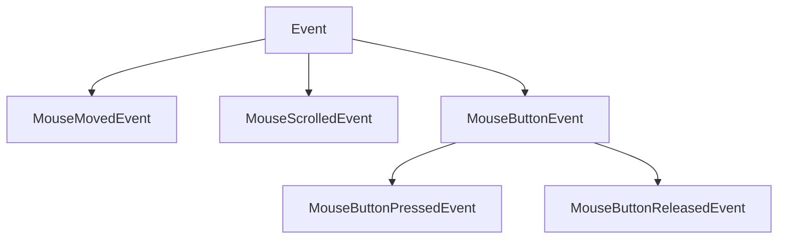
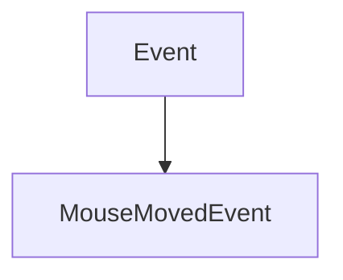
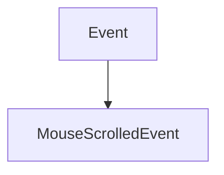
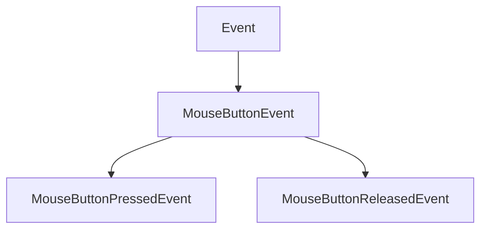
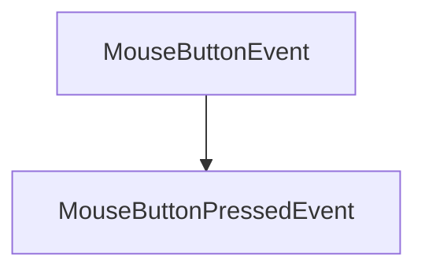
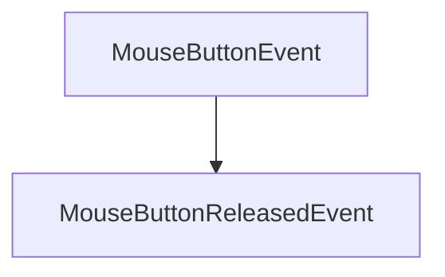

# MouseEvent

The MouseEvent class of the Events. It contains the classes that will be used to manage mouse events.

It herites from the Event class.



It contains the following classes with their own methods:

## MouseMovedEvent

The MouseMovedEvent class of the Events. It contains the classes that will be used to manage the mouse moved event.

It herites from the Event class.



It contains the following methods:

### GetX

```c++
float GetX() const;
```

It returns the x position of the mouse.

### GetY

```c++
float GetY() const;
```

It returns the y position of the mouse.

## MouseScrolledEvent

The MouseScrolledEvent class of the Events. It contains the classes that will be used to manage the mouse scrolled event.

It herites from the Event class.



It contains the following methods:

### GetXOffset

```c++
float GetXOffset() const;
```

It returns the x offset of the mouse.

### GetYOffset

```c++
float GetYOffset() const;
```

It returns the y offset of the mouse.

## MouseButtonEvent

The MouseButtonEvent class of the Events. It contains the classes that will be used to manage the mouse button event.

It herites from the Event class and all MouseButtons must herit from this class :



It contains the following method:

### GetButton

```c++
int GetButton() const;
```

It returns the button of the mouse.

## MouseButtonPressedEvent

The MouseButtonPressedEvent class of the Events. It contains the classes that will be used to manage the mouse button pressed event.

It herites from the MouseButtonEvent class.



It doesn't contain any specific method.

## MouseButtonReleasedEvent

The MouseButtonReleasedEvent class of the Events. It contains the classes that will be used to manage the mouse button released event.

It herites from the MouseButtonEvent class.



It doesn't contain any specific method.


