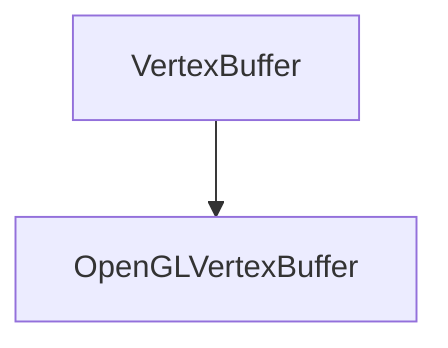
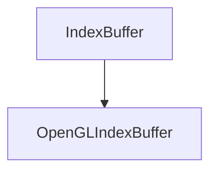

# OpenGLBuffer

The OpenGLBuffer class is used to create and manage OpenGL buffers.

## OpenGLVertexBuffer

The OpenGLVertexBuffer class is used to create and manage OpenGL vertex buffers.

### Heritage {id=open-gl-vertex-buffer-heritage}



### Public Methods {id=open-gl-vertex-buffer-public-methods}

- **OpenGLVertexBuffer**
  ```c++
  OpenGLVertexBuffer(uint32_t size);
  ```
  Creates a new OpenGL vertex buffer with the specified size.
  ```c++
    OpenGLVertexBuffer(float* vertices, uint32_t size);
  ```
  
  It takes the following parameters:

  | Name     | Type     | Description                     |
  |----------|----------|---------------------------------|
  | vertices | float*   | A pointer to the vertices data. |
  | size     | uint32_t | The size of the vertices data.  |

  Here is an example of how to use it:
  ```c++
  float vertices[] = {
        -0.5f, -0.5f, 0.0f, 0.0f, 0.0f,
         0.5f, -0.5f, 0.0f, 1.0f, 0.0f,
         0.5f,  0.5f, 0.0f, 1.0f, 1.0f,
        -0.5f,  0.5f, 0.0f, 0.0f, 1.0f
  };
  OpenGLVertexBuffer vertexBuffer(vertices, sizeof(vertices));
  ```

- **Bind**
  ```c++
  void Bind() const override;
  ```
  Binds the vertex buffer.
  
  Here is an example of how to use it:
  ```c++  
    vertexBuffer.Bind();
  ```

- **Unbind**
  ```c++
  void Unbind() const override;
  ```
  Unbinds the vertex buffer.
  
    Here is an example of how to use it:
    ```c++  
        vertexBuffer.Unbind();
    ```
  
- **SetLayout**
    ```c++
    void SetLayout(const BufferLayout& layout) override;
    ```
    Sets the layout of the vertex buffer.

    It takes the following parameters:

    | Name   | Type          | Description                      |
    |--------|---------------|----------------------------------|
    | layout | BufferLayout& | The layout of the vertex buffer. |

    Here is an example of how to use it:
    ```c++
    BufferLayout layout = {
        { ShaderDataType::Float3, "a_Position" },
        { ShaderDataType::Float2, "a_TexCoord" }
    };
    vertexBuffer.SetLayout(layout);
    ```
  
- **GetLayout**
    ```c++
    const BufferLayout& GetLayout() const override;
    ```
    Returns the layout of the vertex buffer.

    Here is an example of how to use it:
    ```c++
    BufferLayout layout = vertexBuffer.GetLayout();
    ```

- **SetData**
    ```c++
    void SetData(const void* data, uint32_t size) override;
    ```
    Sets the data of the vertex buffer.

    It takes the following parameters:

    | Name | Type     | Description                                                                 |
    | ---- | -------- | --------------------------------------------------------------------------- |
    | data | void*    | A pointer to the data.                                                      |
    | size | uint32_t | The size of the data.                                                       |

    Here is an example of how to use it:
    ```c++
    float vertices[] = {
        -0.5f, -0.5f, 0.0f, 0.0f, 0.0f,
         0.5f, -0.5f, 0.0f, 1.0f, 0.0f,
         0.5f,  0.5f, 0.0f, 1.0f, 1.0f,
        -0.5f,  0.5f, 0.0f, 0.0f, 1.0f
    };
    vertexBuffer.SetData(vertices, sizeof(vertices));
    ```

## OpenGLIndexBuffer

The OpenGLIndexBuffer class is used to create and manage OpenGL index buffers.

### Heritage {id=open-gl-index-buffer-heritage}



### Public Methods {id=open-gl-index-buffer-public-methods}

- **OpenGLIndexBuffer**
  ```c++
  OpenGLIndexBuffer(uint32_t* indices, uint32_t count);
  ```
  Creates a new OpenGL index buffer with the specified indices and count.
  
  It takes the following parameters:

  | Name    | Type     | Description                      |
  |---------|----------|----------------------------------|
  | indices | uint32_t | A pointer to the indices data.   |
  | count   | uint32_t | The count of the indices data.   |

  Here is an example of how to use it:
  ```c++
  uint32_t indices[] = { 0, 1, 2, 2, 3, 0 };
  OpenGLIndexBuffer indexBuffer(indices, sizeof(indices) / sizeof(uint32_t));
  ```

- **Bind**
  ```c++
    void Bind() const override;
    ```
    Binds the index buffer.

- **Unbind**
  ```c++
    void Unbind() const override;
    ```
    Unbinds the index buffer.

- **GetCount**
    ```c++
    uint32_t GetCount() const override;
    ```
    Returns the count of the index buffer.

    Here is an example of how to use it:
    ```c++
    uint32_t count = indexBuffer.GetCount();
    ```


