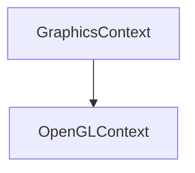

# OpenGLContext

The OpenGLContext is the class that will be used to create the OpenGL context.

## Heritage {id=open-gl-context-heritage}



## Public Methods {id=open-gl-context-public-methods}

- **OpenGLContext**
  ```c++
  OpenGLContext(GLFWwindow* windowHandle);
  ```
  Creates a new OpenGL context with the specified window handle.
  
  Here is an example of how to use it:
  ```c++
  OpenGLContext context(window);
  ```

- **Init**
  ```c++
    void Init() override;
    ```
    Initializes the OpenGL context.

- **SwapBuffers**
  ```c++
  void SwapBuffers() override;
  ```
  Swaps the OpenGL context buffers.

  Here is an example of how to use it:
  ```c++
  context.SwapBuffers();
  ```