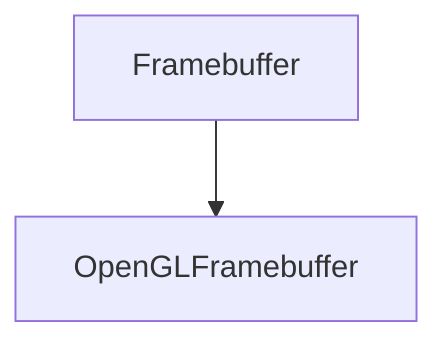

# OpenGLFramebuffer

The OpenGLFramebuffer is the class that will be used to create the OpenGL framebuffer.

## Heritage {id=open-gl-framebuffer-heritage}



## Public Methods {id=open-gl-framebuffer-public-methods}

- **OpenGLFramebuffer**
  ```c++
  OpenGLFramebuffer(const FramebufferSpecification& spec);
  ```
  Creates a new OpenGL framebuffer with the specified specification.
  
  Here is an example of how to use it:
  ```c++
  FramebufferSpecification spec;
  spec.Width = 1280;
  spec.Height = 720;
  spec.Attachments = { FramebufferTextureFormat::RGBA8, FramebufferTextureFormat::RED_INTEGER, FramebufferTextureFormat::Depth };
  spec.Samples = 1;
  spec.ClearColor = { 0.1f, 0.1f, 0.1f, 1.0f };
  m_Framebuffer = Framebuffer::Create(spec);
  ```

- **Bind**
  ```c++
  void Bind() override;
  ```
  Binds the framebuffer.
  
  Here is an example of how to use it:
  ```c++
  m_Framebuffer->Bind();
  ```

- **Unbind**
  ```c++
    void Unbind() override;
    ```
    Unbinds the framebuffer.

    Here is an example of how to use it:
    ```c++
    m_Framebuffer->Unbind();
    ```

- **Resize**
    ```c++
    void Resize(uint32_t width, uint32_t height) override;
    ```
    Resizes the framebuffer.
    
    It takes the following parameters:
    
    | Name   | Type     | Description        |
    |--------|----------|--------------------|
    | width  | uint32_t | The new width.     |
    | height | uint32_t | The new height.    |
    
    Here is an example of how to use it:
    ```c++
    m_Framebuffer->Resize(1280, 720);
    ```

- **ReadPixel**
    ```c++
    int ReadPixel(uint32_t attachmentIndex, int x, int y) override;
    ```
    Reads a pixel from the framebuffer.
    
    It takes the following parameters:
    
    | Name            | Type     | Description        |
    |-----------------|----------|--------------------|
    | attachmentIndex | uint32_t | The attachment.    |
    | x               | int      | The x position.    |
    | y               | int      | The y position.    |
    
    Here is an example of how to use it:
    ```c++
    m_Framebuffer->ReadPixel(0, 0, 0);
    ```

- **ClearAttachment**
    ```c++
    void ClearAttachment(uint32_t attachmentIndex, int value) override;
    ```
    Clears an attachment of the framebuffer.
    
    It takes the following parameters:
    
    | Name            | Type     | Description        |
    |-----------------|----------|--------------------|
    | attachmentIndex | uint32_t | The attachment.    |
    | value           | int      | The value.         |
    
    Here is an example of how to use it:
    ```c++
    m_Framebuffer->ClearAttachment(0, 0);
    ```

- **GetSpecification**
    ```c++
    const FramebufferSpecification& GetSpecification() const override;
    ```
    Returns the specification of the framebuffer.
    
    Here is an example of how to use it:
    ```c++
    FramebufferSpecification spec = m_Framebuffer->GetSpecification();
    ```

- **GetColorAttachmentRendererID**
    ```c++
    uint32_t GetColorAttachmentRendererID(uint32_t index = 0) const override;
    ```
    Returns the color attachment renderer ID of the framebuffer.

    It takes the following parameters:

    | Name  | Type     | Description        |
    |-------|----------|--------------------|
    | index | uint32_t | The index.         |

    Here is an example of how to use it:
    ```c++
    uint32_t colorAttachmentRendererID = m_Framebuffer->GetColorAttachmentRendererID();
    ```
