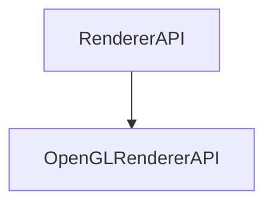

# OpenGLRendererAPI

The OpenGLRendererAPI is the class that will be used to render the scene using OpenGL.

## Heritage {id=open-gl-renderer-api-heritage}



## Init

```c++
void Init() override;
```

Initializes the OpenGL renderer API.

## Clear

```c++
void Clear() override;
```

Clears the OpenGL renderer API.

## DrawIndexed

```c++
void DrawIndexed(const Ref<VertexArray>& vertexArray, uint32_t indexCount = 0) override;
```

Draws the specified vertex array.

It takes the following parameters:

| Name        | Type                     | Description                                                                 |
|-------------|--------------------------|-----------------------------------------------------------------------------|
| vertexArray | const Ref\<VertexArray\> | A reference to the vertex array to draw.                                    |
| indexCount  | uint32_t                 | The number of indices to draw.                                              |

Here is an example of how to use it:
```c++
const auto& vertexArray = mesh->GetVertexArray();
rendererAPI->DrawIndexed(vertexArray);
```

## DrawLines

```c++
void DrawLines(const Ref<VertexArray>& vertexArray, uint32_t indexCount = 0) override;
```

Draws the specified vertex array as lines.

It takes the following parameters:

| Name        | Type                     | Description                                                                 |
|-------------|--------------------------|-----------------------------------------------------------------------------|
| vertexArray | const Ref\<VertexArray\> | A reference to the vertex array to draw.                                    |
| indexCount  | uint32_t                 | The number of indices to draw.                                              |

Here is an example of how to use it:
```c++
const auto& vertexArray = mesh->GetVertexArray();
rendererAPI->DrawLines(vertexArray);
```

## SetLineWidth

```c++
void SetLineWidth(float width) override;
```

Sets the line width.

It takes the following parameters:

| Name  | Type   | Description                                                                 |
|-------|--------|-----------------------------------------------------------------------------|
| width | float  | The new line width.                                                         |

Here is an example of how to use it:
```c++
rendererAPI->SetLineWidth(2.0f);
```

## SetClearColor

```c++
void SetClearColor(const glm::vec4& color) override;
```

Sets the clear color.

It takes the following parameters:

| Name  | Type             | Description                                                                 |
|-------|------------------|-----------------------------------------------------------------------------|
| color | const glm::vec4& | The new clear color.                                                        |

Here is an example of how to use it:
```c++
rendererAPI->SetClearColor(glm::vec4(0.0f, 0.0f, 0.0f, 1.0f));
```

## SetViewport

```c++
void SetViewport(uint32_t x, uint32_t y, uint32_t width, uint32_t height) override;
```

Sets the viewport.

It takes the following parameters:

| Name   | Type     | Description                                                                 |
|--------|----------|-----------------------------------------------------------------------------|
| x      | uint32_t | The x position of the viewport.                                             |
| y      | uint32_t | The y position of the viewport.                                             |
| width  | uint32_t | The width of the viewport.                                                  |
| height | uint32_t | The height of the viewport.                                                 |

Here is an example of how to use it:
```c++
rendererAPI->SetViewport(0, 0, 1280, 720);
```


