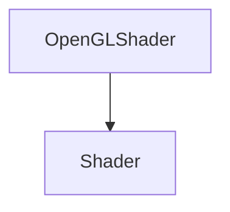

# OpenGLShader

The OpenGLShader class is used to load and compile shaders.

## Heritage



## OpenGLShader

```c++
OpenGLShader(const std::string& filepath);
OpenGLShader(const std::string& name, const std::string& vertexSrc, const std::string& fragmentSrc);
```

It creates a shader from a file or from a string.

The constructor takes the following parameters:

| Name        | Type               | Description                |
|-------------|--------------------|----------------------------|
| filepath    | const std::string& | The path to the file       |
| name        | const std::string& | The name of the shader     |
| vertexSrc   | const std::string& | The vertex shader source   |
| fragmentSrc | const std::string& | The fragment shader source |

Here is an example of how to use it:

```c++
std::string fragmentSrc = R"(
  #version 330 core

  layout(location = 0) out vec4 color;

  void main()
  {
    color = vec4(1.0, 0.0, 0.0, 1.0);
  }
)";

std::string vertexSrc = R"(
  #version 330 core

  layout(location = 0) in vec4 position;

  void main()
  {
    gl_Position = position;
  }
)";

OpenGLShader shader("path/to/shader.glsl");
OpenGLShader shader("shader", vertexSrc, fragmentSrc);
```

## Bind

```c++
void Bind() const override;
```

It binds the shader.

## Unbind

```c++
void Unbind() const override;
```

It unbinds the shader.

## UploadUniformInt

```c++
void UploadUniformInt(const std::string& name, int value);
```

It uploads an integer to the shader.

The method takes the following parameters:

| Name  | Type               | Description          |
|-------|--------------------|----------------------|
| name  | const std::string& | The name of the data |
| value | int                | The value to upload  |

You can use it like this:

```c++
shader->UploadUniformInt("u_Texture", 0);
```

## UploadUniformFloat

```c++
void UploadUniformFloat(const std::string& name, float value);
```

It uploads a float to the shader.

The method takes the following parameters:

| Name  | Type               | Description          |
|-------|--------------------|----------------------|
| name  | const std::string& | The name of the data |
| value | float              | The value to upload  |

You can use it like this:

```c++
shader->UploadUniformFloat("u_Time", 0.0f);
```

## UploadUniformFloat2

```c++
void UploadUniformFloat2(const std::string& name, const glm::vec2& value);
```

It uploads a glm::vec2 to the shader.

The method takes the following parameters:

| Name  | Type               | Description          |
|-------|--------------------|----------------------|
| name  | const std::string& | The name of the data |
| value | const glm::vec2&   | The value to upload  |

You can use it like this:

```c++
shader->UploadUniformFloat2("u_Resolution", glm::vec2(1280, 720));
```

## UploadUniformFloat3

```c++
void UploadUniformFloat3(const std::string& name, const glm::vec3& value);
```

It uploads a glm::vec3 to the shader.

The method takes the following parameters:

| Name  | Type               | Description          |
|-------|--------------------|----------------------|
| name  | const std::string& | The name of the data |
| value | const glm::vec3&   | The value to upload  |

You can use it like this:

```c++
shader->UploadUniformFloat3("u_Color", glm::vec3(1.0f, 0.0f, 0.0f));
```

## UploadUniformFloat4

```c++
void UploadUniformFloat4(const std::string& name, const glm::vec4& value);
```

It uploads a glm::vec4 to the shader.

The method takes the following parameters:

| Name  | Type               | Description          |
|-------|--------------------|----------------------|
| name  | const std::string& | The name of the data |
| value | const glm::vec4&   | The value to upload  |

You can use it like this:

```c++
shader->UploadUniformFloat4("u_Color", glm::vec4(1.0f, 0.0f, 0.0f, 1.0f));
```

## UploadUniformMat3

```c++
void UploadUniformMat3(const std::string& name, const glm::mat3& matrix);
```

It uploads a glm::mat3 to the shader.

The method takes the following parameters:

| Name   | Type               | Description          |
|--------|--------------------|----------------------|
| name   | const std::string& | The name of the data |
| matrix | const glm::mat3&   | The value to upload  |

You can use it like this:

```c++
shader->UploadUniformMat3("u_Transform", glm::mat3(1.0f));
```

## UploadUniformMat4

```c++
void UploadUniformMat4(const std::string& name, const glm::mat4& matrix);
```

It uploads a glm::mat4 to the shader.

The method takes the following parameters:

| Name   | Type               | Description          |
|--------|--------------------|----------------------|
| name   | const std::string& | The name of the data |
| matrix | const glm::mat4&   | The value to upload  |

You can use it like this:

```c++
shader->UploadUniformMat4("u_Transform", glm::mat4(1.0f));
```

## GetName

```c++
const std::string& GetName() const override;
```

It returns the name of the shader.

Here is an example of how to use it:

```c++
std::cout << shader->GetName() << std::endl;
```

## SetInt

```c++
void SetInt(const std::string& name, int value);
```

It sets an integer to the shader.

The method takes the following parameters:

| Name  | Type               | Description          |
|-------|--------------------|----------------------|
| name  | const std::string& | The name of the data |
| value | int                | The value to set     |

You can use it like this:

```c++
shader->SetInt("u_Texture", 0);
```

## SetIntArray

```c++
void SetIntArray(const std::string& name, int* values, uint32_t count);
```

It sets an array of integers to the shader.

The method takes the following parameters:

| Name   | Type               | Description          |
|--------|--------------------|----------------------|
| name   | const std::string& | The name of the data |
| values | int*               | The values to set    |
| count  | uint32_t           | The number of values |

You can use it like this:

```c++
int samplers[2] = { 0, 1 };
shader->SetIntArray("u_Textures", samplers, 2);
```

## SetFloat

```c++
void SetFloat(const std::string& name, float value);
```

It sets a float to the shader.

The method takes the following parameters:

| Name  | Type               | Description          |
|-------|--------------------|----------------------|
| name  | const std::string& | The name of the data |
| value | float              | The value to set     |

You can use it like this:

```c++
shader->SetFloat("u_Time", 0.0f);
```

## SetFloat2

```c++
void SetFloat2(const std::string& name, const glm::vec2& value);
```

It sets a glm::vec2 to the shader.

The method takes the following parameters:

| Name  | Type               | Description          |
|-------|--------------------|----------------------|
| name  | const std::string& | The name of the data |
| value | const glm::vec2&   | The value to set     |

You can use it like this:

```c++
shader->SetFloat2("u_Resolution", glm::vec2(1280, 720));
```

## SetFloat3

```c++
void SetFloat3(const std::string& name, const glm::vec3& value);
```

It sets a glm::vec3 to the shader.

The method takes the following parameters:

| Name  | Type               | Description          |
|-------|--------------------|----------------------|
| name  | const std::string& | The name of the data |
| value | const glm::vec3&   | The value to set     |

You can use it like this:

```c++
shader->SetFloat3("u_Color", glm::vec3(1.0f, 0.0f, 0.0f));
```

## SetFloat4

```c++
void SetFloat4(const std::string& name, const glm::vec4& value);
```

It sets a glm::vec4 to the shader.

The method takes the following parameters:

| Name  | Type               | Description          |
|-------|--------------------|----------------------|
| name  | const std::string& | The name of the data |
| value | const glm::vec4&   | The value to set     |

You can use it like this:

```c++
shader->SetFloat4("u_Color", glm::vec4(1.0f, 0.0f, 0.0f, 1.0f));
```

## SetMat4

```c++
void SetMat4(const std::string& name, const glm::mat4& matrix);
```

It sets a glm::mat4 to the shader.

The method takes the following parameters:

| Name   | Type               | Description          |
|--------|--------------------|----------------------|
| name   | const std::string& | The name of the data |
| matrix | const glm::mat4&   | The value to set     |

You can use it like this:

```c++
shader->SetMat4("u_Transform", glm::mat4(1.0f));
```

