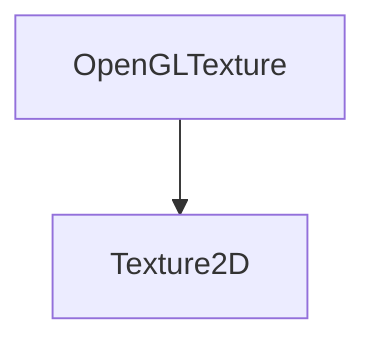

# OpenGLTexture

Implementation of the Texture2D class using OpenGL.
This class represents a 2D texture using OpenGL and provides methods for binding and setting texture data.

## Heritage



## OpenGLTexture

```c++
OpenGLTexture(const TextureSpecification &spec, Buffer data);
```

It creates a texture from a specification and a buffer.

The constructor takes the following parameters:

| Name | Type                        | Description                      |
|------|-----------------------------|----------------------------------|
| spec | const TextureSpecification& | The specification of the texture |
| data | Buffer                      | The data of the texture          |

Here is an example of how to use it:

```c++
TextureSpecification spec;
spec.width = 128;
spec.height = 128;
spec.format = TextureFormat::RGBA8;
spec.wrapS = TextureWrap::REPEAT;
spec.wrapT = TextureWrap::REPEAT;
spec.filterMin = TextureFilter::LINEAR;
spec.filterMag = TextureFilter::LINEAR;
```

## Bind

```c++
void Bind(uint32_t slot = 0) const override;
```

It binds the texture to a texture slot.

The method takes the following parameters:

| Name | Type     | Description        |
|------|----------|--------------------|
| slot | uint32_t | The texture slot   |

Here is an example of how to use it:

```c++
texture->Bind(0);
```

## operator==

```c++
bool operator==(const Texture &other) const override;
```

It compares two textures.

The method takes the following parameters:

| Name  | Type          | Description        |
|-------|---------------|--------------------|
| other | const Texture | The other texture  |

Here is an example of how to use it:

```c++
if (*texture == *otherTexture)
    std::cout << "The textures are the same" << std::endl;
```

## GetWidth

```c++
uint32_t GetWidth() const override;
```

It returns the width of the texture.

Here is an example of how to use it:

```c++
std::cout << texture->GetWidth() << std::endl;
```

## GetHeight

```c++
uint32_t GetHeight() const override;
```

It returns the height of the texture.

Here is an example of how to use it:

```c++
std::cout << texture->GetHeight() << std::endl;
```

## GetRendererID

```c++
uint32_t GetRendererID() const override;
```

It returns the renderer ID of the texture.

Here is an example of how to use it:

```c++
std::cout << texture->GetRendererID() << std::endl;
```

## SetData

```c++
void SetData(Buffer data) override;
```

It sets the data of the texture.

The method takes the following parameters:

| Name | Type   | Description        |
|------|--------|--------------------|
| data | Buffer | The data of texture|

Here is an example of how to use it:

```c++
texture->SetData(data);
```

## IsLoaded

```c++
bool IsLoaded() const override;
```

It returns true if the texture is loaded.

Here is an example of how to use it:

```c++
if (texture->IsLoaded())
    std::cout << "The texture is loaded" << std::endl;
```

## GetSpecification

```c++
const TextureSpecification& GetSpecification() const override;
```

It returns the specification of the texture.

Here is an example of how to use it:

```c++
std::cout << texture->GetSpecification() << std::endl;
```

