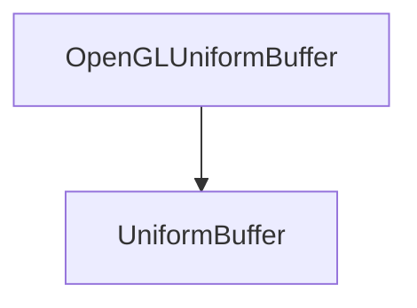

# OpenGLUniformBuffer

The OpenGLUniformBuffer class is used to create uniform buffers.

## Heritage



## OpenGLUniformBuffer

```c++
OpenGLUniformBuffer(uint32_t size, uint32_t binding);
```

It creates a uniform buffer.

The constructor takes the following parameters:

| Name    | Type     | Description        |
|---------|----------|--------------------|
| size    | uint32_t | The size of buffer |
| binding | uint32_t | The binding point  |

Here is an example of how to use it:

```c++
OpenGLUniformBuffer uniformBuffer(128, 0);
```

## SetData

```c++
void SetData(const void *data, uint32_t size, uint32_t offset = 0) override;
```

It sets the data of the buffer.

The method takes the following parameters:

| Name   | Type     | Description        |
|--------|----------|--------------------|
| data   | void*    | The data           |
| size   | uint32_t | The size of buffer |
| offset | uint32_t | The offset         |

Here is an example of how to use it:

```c++
float data[4] = { 0.0f, 0.0f, 0.0f, 0.0f };
uniformBuffer->SetData(data, sizeof(data));
```
