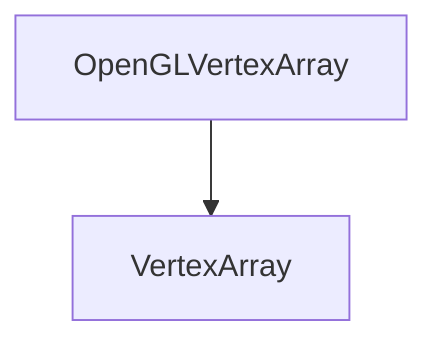

# OpenGLVertexArray

The OpenGLVertexArray class is used to create vertex arrays.

## Heritage



## OpenGLVertexArray

```c++
OpenGLVertexArray();
```

It creates a vertex array.

Here is an example of how to use it:

```c++
OpenGLVertexArray vertexArray;
```

## Bind

```c++
void Bind() const override;
```

It binds the vertex array.

Here is an example of how to use it:

```c++
vertexArray->Bind();
```

## AddVertexBuffer

```c++
void AddVertexBuffer(const Ref<VertexBuffer> &vertexBuffer) override;
```

It adds a vertex buffer to the vertex array.

The method takes the following parameters:

| Name         | Type                          | Description        |
|--------------|-------------------------------|--------------------|
| vertexBuffer | const Ref\<VertexBuffer\>&    | The vertex buffer  |

Here is an example of how to use it:

```c++
vertexArray->AddVertexBuffer(vertexBuffer);
```

## SetIndexBuffer

```c++
void SetIndexBuffer(const Ref<IndexBuffer> &indexBuffer) override;
```

It sets the index buffer of the vertex array.

The method takes the following parameters:

| Name        | Type                       | Description        |
|-------------|----------------------------|--------------------|
| indexBuffer | const Ref\<IndexBuffer\>&  | The index buffer   |

Here is an example of how to use it:

```c++
vertexArray->SetIndexBuffer(indexBuffer);
```

## GetVertexBuffers

```c++
const std::vector<Ref<VertexBuffer>>& GetVertexBuffers() const override;
```

It returns the vertex buffers of the vertex array.

Here is an example of how to use it:

```c++
std::vector<Ref<VertexBuffer>> vertexBuffers = vertexArray->GetVertexBuffers();
```

## GetIndexBuffer

```c++
const Ref<IndexBuffer>& GetIndexBuffer() const override;
```

It returns the index buffer of the vertex array.

Here is an example of how to use it:

```c++
Ref<IndexBuffer> indexBuffer = vertexArray->GetIndexBuffer();
```
