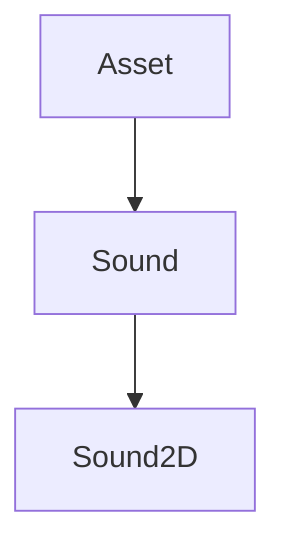
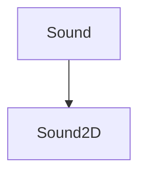

# Sound

The Sound part of the Renderer. It contains the classes that will be used to create sounds.

It defines the class `Sound` and the class `Sound2D`.



IT contains the following  methods:

## Play

```c++
void Play();
```

It plays the sound.

It can be used like this:

```c++
sound.Play();
```

## Pause

```c++
void Pause();
```

It pauses the sound.

It can be used like this:

```c++
sound.Pause();
```

## Stop

```c++
void Stop();
```

It stops the sound.

It can be used like this:

```c++
sound.Stop();
```

## SetVolume

```c++
void SetVolume(float volume);
```

It sets the volume of the sound.
    
It takes the following parameters:

| Name   | Type  | Description |
|--------|-------|-------------|
| volume | float | The volume  |

It can be used like this:

```c++
sound.SetVolume(volume);
```

## SetLoop

```c++
void SetLoop(bool loop);
```

It sets the loop of the sound.

It takes the following parameters:

| Name | Type | Description |
|------|------|-------------|
| loop | bool | The loop    |

It can be used like this:

```c++
sound.SetLoop(loop);
```

## IsPlaying

```c++
bool IsPlaying() const;
```

It returns if the sound is playing.

It returns a bool.

It can be used like this:

```c++
bool isPlaying = sound.IsPlaying();
```

## IsPaused

```c++
bool IsPaused() const;
```

It returns if the sound is paused.

It returns a bool.

It can be used like this:

```c++
bool isPaused = sound.IsPaused();
```

## IsStopped

```c++
bool IsStopped() const;
```

It returns if the sound is stopped.

It returns a bool.

It can be used like this:

```c++
bool isStopped = sound.IsStopped();
```

## Sound2D

The Sound2D class. It inherits from the Sound class.

It defines the class `Sound2D`.



It contains the following  methods:

## Create

```c++
static Ref<Sound2D> Create(const std::string &filepath);
```

It creates a new Sound2D.

It takes the following parameters:

| Name     | Type               | Description |
|----------|--------------------|-------------|
| filepath | const std::string& | The filepath|

It can be used like this:

```c++
Ref<Sound2D> sound2D = Sound2D::Create("assets/sounds/Background.mp3");
```

## GetStaticType

```c++
static AssetType GetStaticType();
```

It returns the static type.

It returns a AssetType.

It can be used like this:

```c++
AssetType assetType = Sound2D::GetStaticType();
```

## GetType

```c++
AssetType GetType() const override;
```

It returns the type.

It returns a AssetType.

It can be used like this:

```c++
AssetType assetType = sound2D->GetType();
```


