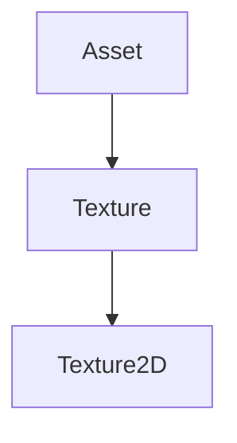
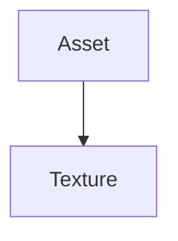

# Texture

The Texture part of the Renderer. It contains the classes that will be used to create textures.

It defines two classes :

- [**Texture**](#texture) : The Texture class of the Renderer. It contains the classes that will be used to create textures.
- [**Texture2D**](#texture2d) : The Texture2D class of the Renderer. It contains the classes that will be used to create 2D textures.



## ImageFormat

The ImageFormat enum of the Texture. It contains the classes that will be used to create image formats.

It defines the following image formats:

- **None** : The None image format of the Texture. It contains the classes that will be used to create the None image format.
- **R8** : The R8 image format of the Texture. It contains the classes that will be used to create the R8 image format.
- **RGB8** : The RGB8 image format of the Texture. It contains the classes that will be used to create the RGB8 image format.
- **RGBA8** : The RGBA8 image format of the Texture. It contains the classes that will be used to create the RGBA8 image format.
- **RGBA32F** : The RGBA32F image format of the Texture. It contains the classes that will be used to create the RGBA32F image format.

## TextureSpecification

The TextureSpecification struct of the Texture. It contains the classes that will be used to create texture specifications.

It defines the following properties:

| Name         | Type        | Description       |
|--------------|-------------|-------------------|
| Width        | uint32_t    | The width         |
| Height       | uint32_t    | The height        |
| Format       | ImageFormat | The image format  |
| GenerateMips | bool        | The generate mips |

## Texture

The Texture class of the Texture. It contains the classes that will be used to create textures.



It contains the following methods:

### Bind

```c++
virtual void Bind(uint32_t slot = 0) const = 0;
```

It binds the texture.

It takes the following parameters:

| Name | Type     | Description |
|------|----------|-------------|
| slot | uint32_t | The slot    |

It can be used like this:

```c++
texture->Bind();
```

### GetWidth

```c++
virtual uint32_t GetWidth() const = 0;
```

It gets the width of the texture.

It can be used like this:

```c++
uint32_t width = texture->GetWidth();
```

### GetHeight

```c++
virtual uint32_t GetHeight() const = 0;
```

It gets the height of the texture.

It can be used like this:

```c++
uint32_t height = texture->GetHeight();
```

### GetRendererID

```c++
virtual uint32_t GetRendererID() const = 0;
```

It gets the renderer id of the texture.

It can be used like this:

```c++
uint32_t renderer_id = texture->GetRendererID();
```

### SetData

```c++
virtual void SetData(void *data, uint32_t size) = 0;
```

It sets the data of the texture.

It takes the following parameters:

| Name | Type     | Description |
|------|----------|-------------|
| data | void*    | The data    |
| size | uint32_t | The size    |

It can be used like this:

```c++
texture->SetData(data, size);
```

### IsLoaded

```c++
virtual bool IsLoaded() const = 0;
```

It returns whether the texture is loaded.

It returns a bool.

It can be used like this:

```c++
bool loaded = texture->IsLoaded();
```

### GetSpecification

```c++
virtual const TextureSpecification &GetSpecification() const = 0;
```

It returns the texture specification.

It can be used like this:

```c++
const TextureSpecification& spec = texture->GetSpecification();
```

## Texture2D

The Texture2D class of the Texture. It contains the classes that will be used to create 2D textures.


It contains the following methods:

### Create

```c++
static Ref<Texture2D> Create(const TextureSpecification &spec, Buffer data = Buffer());
```

It creates a new Texture2D.

It takes the following parameters:

| Name | Type | Description |
|------|------|-------------|
| spec | const TextureSpecification& | The texture specification |
| data | Buffer | The data |

It can be used like this:

```c++
Ref<Texture2D> texture = Texture2D::Create(spec, data);
```

### GetStaticType

```c++
static AssetType GetStaticType();
```

It returns the static type.

It returns a AssetType.

It can be used like this:

```c++
AssetType assetType = Texture2D::GetStaticType();
```

### GetType

```c++
AssetType GetType() const override;
```

It returns the type.

It returns a AssetType.

It can be used like this:

```c++
AssetType assetType = texture->GetType();
```


