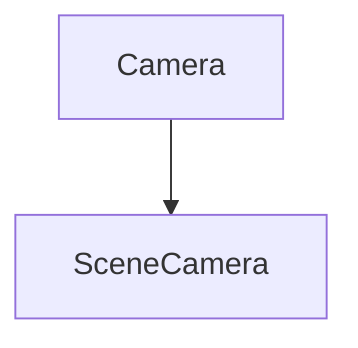

# SceneCamera

The Camera part of the Scene. It contains the classes that will be used to create cameras.

It defines the class `SceneCamera` that herits from `Camera`.



It contains the following  methods:

## Constructor

```c++
SceneCamera();
```

It constructs the SceneCamera.

It can be used like this:

```c++
SceneCamera camera;
```

## SetViewportSize

```c++
void SetViewportSize(uint32_t width, uint32_t height);
```

It sets the viewport size.

It takes the following parameters:

| Name   | Type     | Description |
|--------|----------|-------------|
| width  | uint32_t | The width   |
| height | uint32_t | The height  |

It can be used like this:

```c++
camera.SetViewportSize(width, height);
```

## GetProjectionType

```c++
ProjectionType GetProjectionType() const;
```

It gets the projection type.

It returns a ProjectionType.

It can be used like this:

```c++
ProjectionType projectionType = camera.GetProjectionType();
```

## SetProjectionType

```c++
void SetProjectionType(ProjectionType projectionType);
```

It sets the projection type.

It takes the following parameters:

| Name           | Type          | Description |
|----------------|---------------|-------------|
| projectionType | ProjectionType | The projection type |

It can be used like this:

```c++
camera.SetProjectionType(projectionType);
```

## SetOrthographic

```c++
void SetOrthographic(float size, float nearClip, float farClip);
```

It sets the orthographic.

It takes the following parameters:

| Name     | Type  | Description |
|----------|-------|-------------|
| size     | float | The size    |
| nearClip | float | The near clip |
| farClip  | float | The far clip |

It can be used like this:

```c++
camera.SetOrthographic(size, nearClip, farClip);
```

## GetOrthographicSize

```c++
float GetOrthographicSize() const;
```

It gets the orthographic size.

It returns a float.

It can be used like this:

```c++
float orthographicSize = camera.GetOrthographicSize();
```

## SetOrthographicSize

```c++
void SetOrthographicSize(float size);
```

It sets the orthographic size.

It takes the following parameters:

| Name | Type  | Description |
|------|-------|-------------|
| size | float | The size    |

It can be used like this:

```c++
camera.SetOrthographicSize(size);
```

## GetOrthographicNearClip

```c++
float GetOrthographicNearClip() const;
```

It gets the orthographic near clip.

It returns a float.

It can be used like this:

```c++
float orthographicNearClip = camera.GetOrthographicNearClip();
```

## SetOrthographicNearClip

```c++
void SetOrthographicNearClip(float nearClip);
```

It sets the orthographic near clip.

It takes the following parameters:

| Name     | Type  | Description |
|----------|-------|-------------|
| nearClip | float | The near clip |

It can be used like this:

```c++
camera.SetOrthographicNearClip(nearClip);
```

## GetOrthographicFarClip

```c++
float GetOrthographicFarClip() const;
```

It gets the orthographic far clip.

It returns a float.

It can be used like this:

```c++
float orthographicFarClip = camera.GetOrthographicFarClip();
```

## SetOrthographicFarClip

```c++
void SetOrthographicFarClip(float farClip);
```

It sets the orthographic far clip.

It takes the following parameters:

| Name    | Type  | Description |
|---------|-------|-------------|
| farClip | float | The far clip |

It can be used like this:

```c++
camera.SetOrthographicFarClip(farClip);
```

## SetPerspective

```c++
void SetPerspective(float verticalFOV, float nearClip, float farClip);
```

It sets the perspective.

It takes the following parameters:

| Name        | Type  | Description |
|-------------|-------|-------------|
| verticalFOV | float | The vertical FOV |
| nearClip    | float | The near clip |
| farClip     | float | The far clip |

It can be used like this:

```c++
camera.SetPerspective(verticalFOV, nearClip, farClip);
```

## GetPerspectiveVerticalFOV

```c++
float GetPerspectiveVerticalFOV() const;
```

It gets the perspective vertical FOV.

It returns a float.

It can be used like this:

```c++
float perspectiveVerticalFOV = camera.GetPerspectiveVerticalFOV();
```

## SetPerspectiveVerticalFOV

```c++
void SetPerspectiveVerticalFOV(float verticalFOV);
```

It sets the perspective vertical FOV.

It takes the following parameters:

| Name        | Type  | Description |
|-------------|-------|-------------|
| verticalFOV | float | The vertical FOV |

It can be used like this:

```c++
camera.SetPerspectiveVerticalFOV(verticalFOV);
```

## GetPerspectiveNearClip

```c++
float GetPerspectiveNearClip() const;
```

It gets the perspective near clip.

It returns a float.

It can be used like this:

```c++
float perspectiveNearClip = camera.GetPerspectiveNearClip();
```

## SetPerspectiveNearClip

```c++
void SetPerspectiveNearClip(float nearClip);
```

It sets the perspective near clip.

It takes the following parameters:

| Name     | Type  | Description |
|----------|-------|-------------|
| nearClip | float | The near clip |

It can be used like this:

```c++
camera.SetPerspectiveNearClip(nearClip);
```

## GetPerspectiveFarClip

```c++
float GetPerspectiveFarClip() const;
```

It gets the perspective far clip.

It returns a float.

It can be used like this:

```c++
float perspectiveFarClip = camera.GetPerspectiveFarClip();
```

## SetPerspectiveFarClip

```c++
void SetPerspectiveFarClip(float farClip);
```

It sets the perspective far clip.

It takes the following parameters:

| Name    | Type  | Description |
|---------|-------|-------------|
| farClip | float | The far clip |

It can be used like this:

```c++
camera.SetPerspectiveFarClip(farClip);
```


