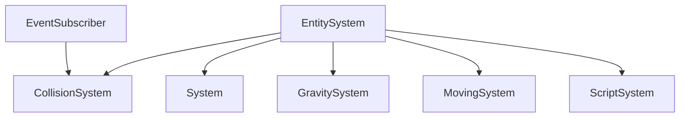
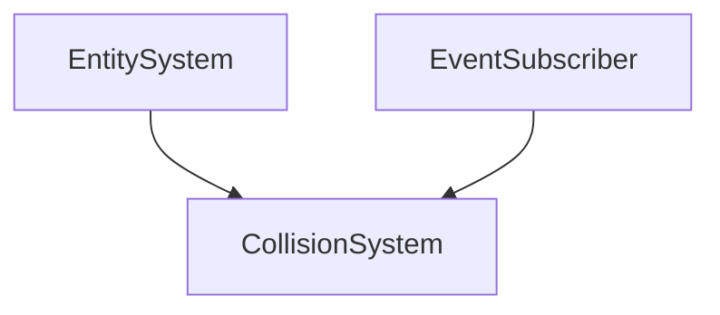
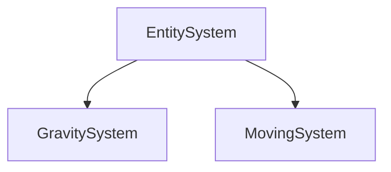
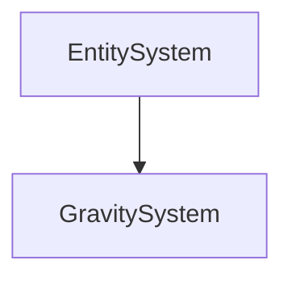
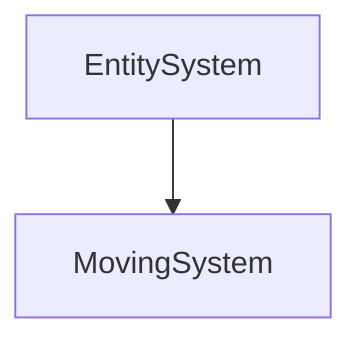
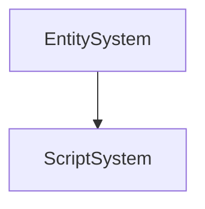

# System

The System part of the ECS. It contains the classes that will be used to manage systems.

It's divided in 3 parts :

- [**Collision**](#collision) : The Collision part of the System. It contains the classes that will be used to manage collisions.
- [**Physics**](#physics) : The Physics part of the System. It contains the classes that will be used to manage physics.
- [**Script**](#script) : The Script part of the System. It contains the classes that will be used to manage scripts.

Everything herits from the `EntitySystem` class.



## Collision

The Collision part of the System. It contains the classes that will be used to manage collisions.

It herits from the `EntitySystem` class and from the `EventSubscriber<Events::OnCollisionEntered>` class.



It defines the `BoundingBox` struct that will be used to manage bounding boxes.

```c++
struct BoundingBox {
    glm::vec2 min;
    glm::vec2 max;
};
```

### Constructor

```c++
CollisionSystem();
```

It creates a collision system.

Here is an example of how to use it:

```c++
CollisionSystem collisionSystem;
```

### Update

```c++
void Update(World *world, Timestep ts);
```

It updates the collision system.

The method takes the following parameters:

| Name  | Type    | Description |
|-------|---------|-------------|
| world | World * | The world   |
| ts    | Timestep | The timestep|

Here is an example of how to use it:

```c++
World *world;
Timestep ts;

collisionSystem.Update(world, ts);
```

### Receive

```c++
void Receive(World *world, const Events::OnCollisionEntered &event);
```

It receives an event.

The method takes the following parameters:

| Name  | Type                       | Description |
|-------|----------------------------|-------------|
| world | World *                    | The world   |
| event | Events::OnCollisionEntered | The event   |

Here is an example of how to use it:

```c++
World *world;
Events::OnCollisionEntered event;

collisionSystem.Receive(world, event);
```

## Physics

The Physics part of the System. It contains the classes that will be used to manage physics.

It defines two classes to manage the physics :

- [**GravitySystem**](#gravitysystem) : The GravitySystem class of the Physics. It contains the classes that will be used to manage the gravity system.
- [**MovingSystem**](#movingsystem) : The MovingSystem class of the Physics. It contains the classes that will be used to manage the moving system.

Both of them herits from the `EntitySystem` class.



### GravitySystem

The GravitySystem class of the Physics. It contains the classes that will be used to manage the gravity system.

It herits from the `EntitySystem` class.



You can initialize it with a gravity value.

```c++
GravitySystem(float gravity = 9.81f);
```

It creates a gravity system that is update with the following method :

```c++
void Update(World *world, Timestep ts);
```

### MovingSystem

The MovingSystem class of the Physics. It contains the classes that will be used to manage the moving system.

It herits from the `EntitySystem` class.



You can initialize it with a gravity value.

```c++
MovingSystem(float gravity = 9.81f);
```

It creates a moving system that is update with the following method :

```c++
void Update(World *world, Timestep ts);
```

## Script

The Script part of the System. It contains the classes that will be used to manage scripts.

It herits from the `EntitySystem` class.



The Script can be initialized like that :

```c++
ScriptSystem();
```

It creates a script system that is update with the following method :

```c++
void Update(World *world, Timestep ts);
```


