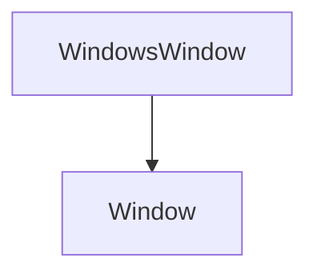

# WindowsWindow

The window part of the Game Engine. It contains the classes that will be used to create the window.

## Heritage 



## WindowsWindow

```c++
WindowsWindow(const WindowProps &props);
```

It creates a window.

The method takes the following parameters:

| Name  | Type          | Description        |
|-------|---------------|--------------------|
| props | const WindowProps& | The window properties |

Here is an example of how to use it:

```c++
Exodia::WindowProps props;
props.title = "Exodia";
props.width = 1280;
props.height = 720;
Exodia::WindowsWindow window(props);
```

## OnUpdate

```c++
void OnUpdate() override;
```

It updates the window.

Here is an example of how to use it:

```c++
window->OnUpdate();
```

## Init

```c++
void Init(const WindowProps &props);
```

It initializes the window.

The method takes the following parameters:

| Name  | Type          | Description        |
|-------|---------------|--------------------|
| props | const WindowProps& | The window properties |
    

Here is an example of how to use it:

```c++
Exodia::WindowProps props;
props.title = "Exodia";
props.width = 1280;
props.height = 720;
window->Init(props);
```

## Shutdown

```c++
void Shutdown() override;
```

It shuts down the window.

Here is an example of how to use it:

```c++
window->Shutdown();
```

## GetWidth

```c++
int GetWidth() const override;
```

It returns the width of the window.

Here is an example of how to use it:

```c++
std::cout << window->GetWidth() << std::endl;
```

## GetHeight

```c++
int GetHeight() const override;
```

It returns the height of the window.

Here is an example of how to use it:

```c++
std::cout << window->GetHeight() << std::endl;
```

## SetEventCallback

```c++
void SetEventCallback(const EventCallbackFn &callback) override;
```

It sets the event callback of the window.

The method takes the following parameters:

| Name     | Type                  | Description        |
|----------|-----------------------|--------------------|
| callback | const EventCallbackFn& | The event callback |

Here is an example of how to use it:

```c++
window->SetEventCallback(callback);
```

## SetVSync

```c++
void SetVSync(bool enabled) override;
```

It sets the VSync of the window.

The method takes the following parameters:

| Name    | Type | Description        |
|---------|------|--------------------|
| enabled | bool | The VSync          |

Here is an example of how to use it:

```c++
window->SetVSync(true);
```

## IsVSync

```c++
bool IsVSync() const override;
```

It returns true if the VSync is enabled.

Here is an example of how to use it:

```c++
std::cout << window->IsVSync() << std::endl;
```

## GetNativeWindow

```c++
void *GetNativeWindow() const override;
```

It returns the native window.

Here is an example of how to use it:

```c++
std::cout << window->GetNativeWindow() << std::endl;
```
