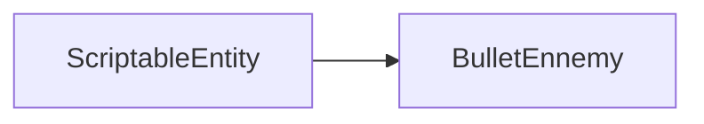

# BulletEnnemy

The script that define the bullet from the enemy. It inherit from the `ScriptableEntity` class.



## CreateAnimations

```c++
void BulletEnnemy::CreateAnimations()
```

The `CreateAnimations` function create the animations of the bullet.

## OnCreate

```c++
void BulletEnnemy::OnCreate()
```

The `OnCreate` function is called when the entity is created.

It set all the components that the entity need.

Then it start the animation.

```c++
CreateAnimations();
```

And finally it emit an `OnEntityCreated` event.

## UpdateAnimations

```c++
void BulletEnnemy::UpdateAnimations()
```

The `UpdateAnimations` function update the animations of the bullet.

First it get the `AnimationComponent` component.

```c++
            anim = HandleEntity->AddComponent<AnimationComponent>(_Animations[0]);
```

Then we check if the bullet is colliding with the player.

```c++
            if (_IsColliding && anim.Get().CurrentFrameIndex == anim.Get().Frames.size() - 1 &&
```

If it is the case we destroy the entity.

```c++
                HandleEntity->GetWorld()->DestroyEntity(HandleEntity);
```

## OnUpdate

```c++
void BulletEnnemy::OnUpdate(UNUSED(Timestep ts))
```

The `OnUpdate` function is called when the entity is updated.

It will check if the bullet is colliding with the border and destroy it if it is.

```c++
world->DestroyEntity(HandleEntity);
```

Then it will update the animations.

```c++
    UpdateAnimations();
```


## OnCollisionEnter

```c++
    void BulletEnnemy::OnCollisionEnter(Entity *entity)
```

The `OnCollisionEnter` function is called when the entity collide with another entity.

It will check if the entity is the player.

```c++
        if (entity->HasTag("Player"))
```

If it is the case it will set the `_IsColliding` variable to true.

```c++
            _IsColliding = true;
```

