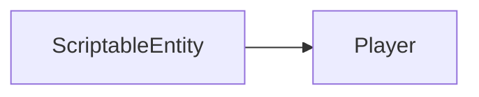

# Player

The script that define the player.

It inherit from the `ScriptableEntity` class.



## CreateAnimations

```c++
void Player::CreateAnimations()
```

The `CreateAnimations` function create the animations of the player.

## OnCreate

```c++
void Player::OnCreate()
```

The `OnCreate` function is called when the entity is created.

It set all the components that the entity need.

Then it start the animation.

```c++
CreateAnimations();
```

And finally it emit an `OnEntityCreated` event.

## Shoot

```c++
    void Player::Shoot(TransformComponent &tc)
```

The `Shoot` function create a bullet from the `TransformComponent` of the player.

## UpdateAnimations

```c++
void Player::UpdateAnimations()
```

The `UpdateAnimations` function update the animations of the player.

It will apply a different animation depending on the state of the player :

- Idle
- MoveUp
- MoveDown


## OnUpdate

```c++
void Player::OnUpdate(Timestep ts)
```

The `OnUpdate` function is called when the entity is updated.

He will check if the entity is dead.

```c++
health.CurrentHealth <= 0;
```

Then update the animation.

```c++
UpdateAnimations();
```


## OnKeyPressed

```c++
void Player::OnKeyPressed(int keycode)
```

The `OnKeyPressed` function is called when a key is pressed.

It will set the `PlayerState` of the player depending on the key pressed, or make him shoot or charge a bullet.

## OnKeyReleased

```c++
void Player::OnKeyReleased(int keycode)
```

The `OnKeyReleased` function is called when a key is released.

It will set the `PlayerState` of the player depending on the key released.

## OnCollisionEnter

```c++
void Player::OnCollisionEnter(Entity *entity)
```

The `OnCollisionEnter` function is called when the entity collide with another entity.

It will check if the entity is a bullet.

```c++
entity->HasTag("BE");
```

If it is the case it will decrease the health of the player.

```c++
            HandleEntity->GetWorld()->Emit<Events::TakeDamage>({HandleEntity, 1});
```
