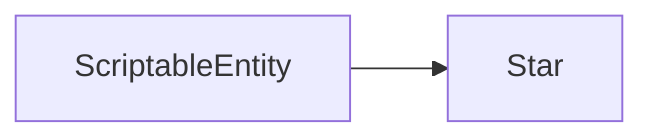

# Star

The `Star` scripts define the stars from the background.

It inherit from the `ScriptableEntity` class.



## OnCreate

```c++
void Star::OnCreate()
```

The `OnCreate` function is called when the entity is created.

It will give the star a random speed and a random spawn point.

## OnUpdate

```c++
void Star::OnUpdate(Timestep ts)
```

The `OnUpdate` function is called when the entity is updated.

It will move the star depending on the speed and the spawn point.
Then it will check if the star is out of the screen.
If it is the case it will move it at the other side of the screen randomly.
