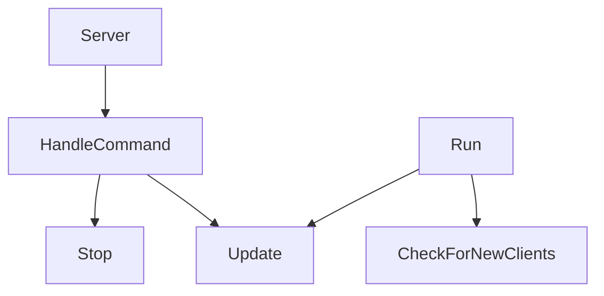

# Server

The `Server` class is the actual server. It is used to send and receive packets.

Here is the calling graph :



## Server

```c++
Server::Server(short port)
        : _WorldNetwork(World::CreateWorld()), _Network(_WorldNetwork, _IOContextManager, port), _LastTime(0.0f),
          _Running(true)
```

It takes the following parameters:

| Name | Type  | Description |
|------|-------|-------------|
| port | short | The port    |

It creates a thread for the server that will get the command from the input and execute it like that:

```c++
        _InputThread = std::thread([&] {
            while (_Running) {
                if (std::cin.peek() != EOF) {
                    std::string inputCommand;

                    std::getline(std::cin, inputCommand);

                    HandleCommand(inputCommand);
                }
            }
        });
```

## ~Server {id="server_1"}

```c++
Server::~Server()
```

The `Server` destructor will stop the server and join the input thread.

```c++
        _Running = false;
        if (_InputThread.joinable())
            _InputThread.join();
```

## HandleCommand

```c++
void Server::HandleCommand(const std::string &command)
```

`HandleCommand` is a function that handles the command.

It takes the following parameters:

| Name    | Type               | Description |
|---------|--------------------|-------------|
| command | const std::string& | The command |

The command could be :

- `stop` : in this case, the server will stop
- `update` : in this case, the server will update
- `dump` : in this case, the server will dump the clients and the number of entities
- `packet` : in this case, the server will send an information packet to the client

## Init

```c++
void Server::Init()
```

`Init` is a function that initializes the server.

It will start by waiting for a client to connect.

```c++
        while (_Network.GetConnections().empty()) {
            EXODIA_TRACE("Waiting for clients to connect...");

            std::this_thread::sleep_for(std::chrono::seconds(1));
        }
```

Then, it will start the server initialization by creating the menu

```c++
Scenes[MENU] = CreateRef<Scene>();
Scenes[MENU]->RegisterSystem(new AnimationSystem());
Scenes[MENU]->RegisterSystem(new MovingSystem(1.5f));
```

Then, it will create the game scene

```c++
            RType::EntityEventSubscriber *subscribe = new RType::EntityEventSubscriber(_Network);
            CollisionSystem *collisionSystem = new CollisionSystem();

            Scenes[GAME] = CreateRef<Scene>();
            Scenes[GAME]->RegisterSystem(new AnimationSystem());
            Scenes[GAME]->RegisterSystem(new MovingSystem(1.5f));
            Scenes[GAME]->RegisterSystem(collisionSystem);
            Scenes[GAME]->Subscribe<Events::OnEntityCreated>(subscribe);
            Scenes[GAME]->Subscribe<Events::OnEntityDestroyed>(subscribe);
            Scenes[GAME]->Subscribe<Events::OnCollisionEntered>(collisionSystem);
```

We can now add entity like the `PataPata`.

```c++
CreatePataPata(Scenes);
```

Then we can set up the camera.

```c++
            Entity *cameraEntity = Scenes[GAME]->CreateEntity("Camera");

            auto &camera = cameraEntity->AddComponent<CameraComponent>().Get();

            cameraEntity->GetComponent<TransformComponent>().Get().Translation = {0.0f, 0.0f, 15.0f};
            cameraEntity->GetComponent<TransformComponent>().Get().Rotation = {0.0f, 0.0f, 45.0f};
            camera.Camera.SetProjectionType(SceneCamera::ProjectionType::Perspective);

            auto body_camera = cameraEntity->AddComponent<RigidBody2DComponent>();

            body_camera.Get().Type = RigidBody2DComponent::BodyType::Dynamic;
            body_camera.Get().Mass = 0.0f;
            body_camera.Get().GravityScale = 0.0f;
            body_camera.Get().Velocity = glm::vec2{1.5f, 0.0f};
```

Finally, we can run the scenes and set the World to the network.

```c++
            Scenes[CurrentScene]->OnRuntimeStart(); // TODO: Remove and play start only when all players are connected
                                                    // or main player said play

            _Network.SetWorld(Scenes[CurrentScene]->GetWorldPtr());
```

## Run

```c++
void Server::Run()
```

The `Run` function is the main loop of the server.

It will check for new clients and update the server.

```c++
        while (_Running) {
            CheckForNewClients();
            this->Update();
        }
```

## Update

```c++
void Server::Update()
```

The `Update` function will update the server.

We will start by updating the time

```c++
float time = _Timer.Elapsed();
Timestep timestep(time - _LastTime);
_LastTime = time;
```

Then, we get the event from the network

```c++
std::vector<std::pair<std::pair<uint32_t, bool>, asio::ip::udp::endpoint>> events = _Network.GetEvents();
```

And for each event we will:

Update the player.

```c++
                Scenes[CurrentScene]->GetWorld().ForEach<ScriptComponent, TagComponent, TransformComponent>(
                    [&](Entity *entity, auto script, auto tag, auto transform) {
                        (void)entity;
                        (void)transform;
                        auto &sc = script.Get();
                        auto &tc = tag.Get();

                        if (tc.Tag == std::string("Player_" + std::to_string(player_id)) && sc.Instance != nullptr) {
                            if (event.first.second) {
                                sc.Instance->OnKeyPressed(event.first.first);
                            } else {
                                sc.Instance->OnKeyReleased(event.first.first);
                            }
                        }
                        if (count % 50 == 0) {
                            _Network.SendComponentOf(entity, "TransformComponent");
                        }
                        _Network.SendComponentOf(entity, "RigidBody2DComponent");
                    });
```

And update the bullets.

```c++
                Scenes[CurrentScene]->GetWorld().ForEach<TagComponent, TransformComponent>(
                    [&](Entity *entity, auto tag, auto transform) {
                        (void)entity;
                        (void)tag;
                        (void)transform;
                        if (tag.Get().Tag.rfind("Bullet") != std::string::npos) {
                            _Network.SendComponentOf(entity, "TagComponent");
                            _Network.SendComponentOf(entity, "SpriteRendererComponent");
                        }
                    });
```

Finally, we will update the scenes

```c++
Scenes[CurrentScene]->OnUpdateRuntime(timestep);
```

## Stop

```c++
void Server::Stop()
```

The `Stop` function will stop the server.

```c++
_Running = false;
```

## CheckForNewClients

`CheckForNewClients` is a private function that checks for new clients.

It starts by checking if the connection is empty.

```c++
if (connections.empty()) {
    return;
}
```

Then, for each connection, it will check if the client is new.

```c++
            for (auto user : _Users) {
                if (user.GetConnection() == connection.second) {
                    newClient = false;
                }
            }
```

If the client is new we will create a new player.

```c++
CreatePlayer(Scenes, (uint32_t)_Users.size());
```

We add the new player to the user list.

```c++
                player = Scenes[GAME]->GetEntityByName("Player_" + std::to_string((uint32_t)_Users.size()));

                _Users.push_back(User(connection.second, player));
```

Finally, we send components:

For the player.

```c++
                    if (tag.Get().Tag.rfind("Player_") != std::string::npos) {
                        _Network.SendComponentOf(entity, "TagComponent");
                        _Network.SendComponentOf(entity, "TransformComponent");
                        _Network.SendComponentOf(entity, "SpriteRendererComponent");
                        _Network.SendComponentOf(entity, "RigidBody2DComponent");
                        _Network.SendComponentOf(entity, "Animation");
                        _Network.SendComponentOf(entity, "Health");
                        _Network.SendComponentOf(entity, "ScriptComponent");
                    }
```

And for the Pata-pata.

```c++
                    if (tag.Get().Tag == "Pata-pata") {
                        _Network.SendComponentOf(entity, "TagComponent");
                        _Network.SendComponentOf(entity, "TransformComponent");
                        _Network.SendComponentOf(entity, "SpriteRendererComponent");
                        _Network.SendComponentOf(entity, "RigidBody2DComponent");
                        _Network.SendComponentOf(entity, "Animation");
                        _Network.SendComponentOf(entity, "Health");
                        _Network.SendComponentOf(entity, "ScriptComponent");
                    }
```
