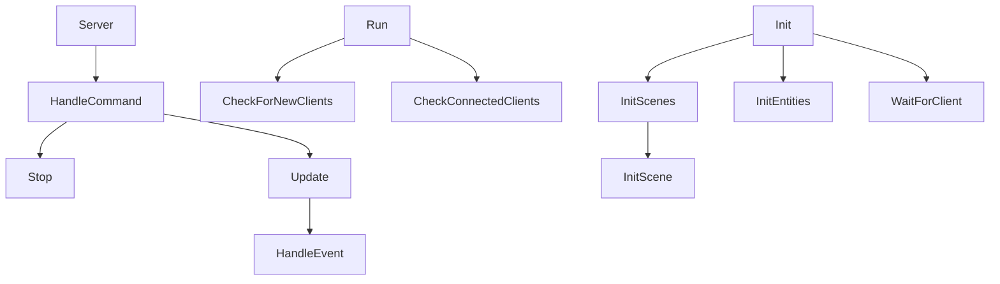

# Server

The `Server` class is the actual server. It is used to send and receive packets.

Here is the calling graph :



## Server

```c++
Server::Server(short port)
        : _WorldNetwork(World::CreateWorld()), _Network(_WorldNetwork, _IOContextManager, port), _LastTime(0.0f),
          _Running(true)
```

It takes the following parameters:

| Name | Type  | Description |
|------|-------|-------------|
| port | short | The port    |

It creates a thread for the server that will get the command from the input and execute it like that:

```c++
        _InputThread = std::thread([&] {
            while (_Running) {
                if (std::cin.peek() != EOF) {
                    std::string inputCommand;

                    std::getline(std::cin, inputCommand);

                    HandleCommand(inputCommand);
                }
            }
        });
```

## ~Server {id="server_1"}

```c++
Server::~Server()
```

The `Server` destructor will stop the server and join the input thread.

```c++
        _Running = false;
        if (_InputThread.joinable())
            _InputThread.join();
```

## HandleCommand

```c++
void Server::HandleCommand(const std::string &command)
```

`HandleCommand` is a function that handles the command.

It takes the following parameters:

| Name    | Type               | Description |
|---------|--------------------|-------------|
| command | const std::string& | The command |

The command could be :

- `stop` : in this case, the server will stop
- `update` : in this case, the server will update
- `dump` : in this case, the server will dump the clients and the number of entities
- `packet` : in this case, the server will send an information packet to the client

## InitScene

```c++
void Server::InitScene(SceneType scene, std::optional<std::vector<Exodia::EntitySystem *>> systems)
```

The function initializes a scene and registers optional entity systems to it.

It takes the following parameters:

| Name    | Type                                                    | Description   |
|---------|---------------------------------------------------------|---------------|
| scene   | SceneType                                               | The scene     |
| systems | std::optional\<std::vector\<Exodia::EntitySystem \*\>\> | The systems   |

In the case of there is systems, it will register it to the scene.

```c++
        if (systems.has_value()) {
            for (EntitySystem *system : systems.value()) {
                Scenes[scene]->RegisterSystem(system);
            }
        }
```

## WaitForClient

```c++
void Server::WaitForClient()
```

The `WaitForClient` function will wait for a client to connect.

```c++
        while (_Network.GetConnections().empty()) {
            EXODIA_TRACE("Waiting for clients to connect...");

            std::this_thread::sleep_for(std::chrono::seconds(1));
        }
```

## InitScenes

```c++
void Server::InitScenes()
```

The `InitScenes` function will initialize the scenes.

It will initialize the menu.

```c++
        std::vector<Exodia::EntitySystem *> systems = {new AnimationSystem(), new MovingSystem(1.5f)};
        InitScene(MENU, systems);
```

and the Game.

```c++
        RType::EntityEventSubscriber *subscribe = new RType::EntityEventSubscriber(_Network);
        CollisionSystem *collisionSystem = new CollisionSystem();
        RType::TakeDamageSubscriber *takeDamage = new RType::TakeDamageSubscriber();
        ClockSystem *clockSystem = new ClockSystem();

        systems.push_back(collisionSystem);
        systems.push_back(clockSystem);

        InitScene(GAME, systems);
```

It will also add the subscribers to the Game scene.

```c++
        Scenes[GAME]->Subscribe<Events::OnEntityCreated>(subscribe);
        Scenes[GAME]->Subscribe<Events::OnEntityDestroyed>(subscribe);
        Scenes[GAME]->Subscribe<Events::OnCollisionEntered>(collisionSystem);
        Scenes[GAME]->Subscribe<RType::Events::TakeDamage>(takeDamage);
```

## InitEntities

```c++
void Server::InitEntities()
```

The `InitEntities` function will initialize the entities.

It will start by creating the `patapata` entity.

```c++
        Entity *patata = Scenes[GAME]->CreateEntity("Pata-pata");

        patata->AddComponent<ScriptComponent>().Get().Bind("PataPata");
```

And then the `camera`.

```c++
        Entity *cameraEntity = Scenes[GAME]->CreateEntity("Camera");

        CameraComponent &camera = cameraEntity->AddComponent<CameraComponent>().Get();

        cameraEntity->GetComponent<TransformComponent>().Get().Translation = {0.0f, 0.0f, 15.0f};
        cameraEntity->GetComponent<TransformComponent>().Get().Rotation = {0.0f, 0.0f, 45.0f};
        camera.Camera.SetProjectionType(SceneCamera::ProjectionType::Perspective);
```

## Init

```c++
void Server::Init()
```

`Init` is a function that initializes the server.

It will initialize the scenes.

```c++
        InitScenes();
```

Then, it will initialize the entities.

```c++
        InitEntities();
```

Then, it will wait for a client to connect.

```c++
        WaitForClient();
```

Finally, we can run the scenes and set the World to the network.

```c++
            Scenes[CurrentScene]->OnRuntimeStart(); // TODO: Remove and play start only when all players are connected
                                                    // or main player said play

            _Network.SetWorld(Scenes[CurrentScene]->GetWorldPtr());
```

## Run

```c++
void Server::Run()
```

The `Run` function is the main loop of the server.

It will check for new clients, update the server and check connected clients.

```c++
        while (_Running) {
            CheckForNewClients();
            this->Update();
            CheckConnectedClients();
            std::this_thread::sleep_for(std::chrono::milliseconds(16)); // Sleep for 32 milliseconds (30 FPS)
        }   
```

## Update

```c++
void Server::Update()
```

The `Update` function will update the server.

We will start by updating the time

```c++
float time = _Timer.Elapsed();
Timestep timestep(time - _LastTime);
_LastTime = time;
```

We will send an info packet if needed.

```c++
            my_Timer += timestep;

            if (my_Timer > 1.0f) {
                my_Timer = 0.0f;

                _Network.SendPacketInfo();
            }
```

We will now synchronize the components.

```c++
                Scenes[CurrentScene]->GetWorld().ForEach<TransformComponent>(
                    [&](Entity *entity, ComponentHandle<TransformComponent> transform) {
                        (void)transform;
                        _Network.SendComponentOf(false, entity, "TransformComponent");
                    });
                Scenes[CurrentScene]->GetWorld().ForEach<Clock>([&](Entity *entity, ComponentHandle<Clock> clock) {
                    (void)clock;
                    _Network.SendComponentOf(false, entity, "Clock");
                });
```

Then we can check for events and handle them.

```c++
            std::vector<std::pair<std::pair<uint32_t, bool>, asio::ip::udp::endpoint>> events = _Network.GetEvents();

            while (!events.empty()) {
                HandleEvent(events[events.size() - 1]);

                events.pop_back();
            }
```

Finally, we will update the scenes

```c++
Scenes[CurrentScene]->OnUpdateRuntime(timestep);
```

## IsClientNew

```c++
bool Server::IsClientNew(std::pair<const std::string, std::shared_ptr<Connection>> connection) {
```

The `IsClientNew` function will check if the client is new.

It takes the following parameters:

| Name       | Type                                               | Description |
|------------|----------------------------------------------------|-------------|
| connection | std::pair\<const std::string, std::shared_ptr\<Connection\>\> | The connection |

For each user, it will check if the connection is the same.

```c++
    for (auto user : _Users) {
        if (user.GetConnection() == connection.second) {
            return false;
        }
    }
```

## Stop

```c++
void Server::Stop()
```

The `Stop` function will stop the server.

```c++
_Running = false;
```

## CheckForNewClients

`CheckForNewClients` is a private function that checks for new clients.

It starts by checking if the connection is empty.

```c++
if (connections.empty()) {
    return;
}
```

Then, for each connection, it will check if the client is new.

```c++
            for (auto user : _Users) {
                if (user.GetConnection() == connection.second) {
                    newClient = false;
                }
            }
```

If the client is new we will create a new player.

```c++
CreatePlayer(Scenes, (uint32_t)_Users.size());
```

We add the new player to the user list.

```c++
                player = Scenes[GAME]->GetEntityByName("Player_" + std::to_string((uint32_t)_Users.size()));

                _Users.push_back(User(connection.second, player));
```

## CheckConnectedClients

```c++
void Server::CheckConnectedClients()
```

The `CheckConnectedClients` function will check the connected clients.

For each connection, it will check if the client is connected.

```c++
        for (auto connection : _Network.GetConnections()) {
            for (auto user : _Users) {
                if (connection.second->GetNetworkInfo().lastPacketReceived->GetHeader().getTimestamp() <
                    connection.second->GetNetworkInfo().lastPacketSent->GetHeader().getTimestamp() - 5000) {
                    EXODIA_CORE_INFO("Client disconnected");
                    _Network.SendDisconnect();
                    _Users.erase(_Users.begin() + i);
                    i--;
                }
            }
```

## SendComponents

```c++
Server::SendComponents(SceneType scene)
```

The `SendComponents` function will send the components of the scene.

For the Player.

```c++
                    if (tag.Get().Tag.rfind("Player_") != std::string::npos) {
                        _Network.SendComponentOf(entity, "TagComponent");
                        _Network.SendComponentOf(entity, "TransformComponent");
                        _Network.SendComponentOf(entity, "SpriteRendererComponent");
                        _Network.SendComponentOf(entity, "RigidBody2DComponent");
                        _Network.SendComponentOf(entity, "Animation");
                        _Network.SendComponentOf(entity, "Health");
                        _Network.SendComponentOf(entity, "ScriptComponent");
                    }
```

And for the Pata-pata.

```c++
                    if (tag.Get().Tag == "Pata-pata") {
                        _Network.SendComponentOf(entity, "TagComponent");
                        _Network.SendComponentOf(entity, "TransformComponent");
                        _Network.SendComponentOf(entity, "SpriteRendererComponent");
                        _Network.SendComponentOf(entity, "RigidBody2DComponent");
                        _Network.SendComponentOf(entity, "Animation");
                        _Network.SendComponentOf(entity, "Health");
                        _Network.SendComponentOf(entity, "ScriptComponent");
                    }
```
